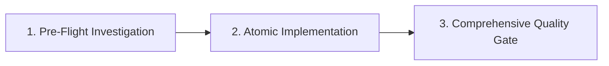

# Absensi SPPG — Aturan Workspace & AI Agent Standar Emas

Ini adalah proyek **Absensi SPPG** dengan dua workspace utama di bawah root `absensi-sppg-app`:
- `mobile/` — Tauri v2 + Next.js 16 static export + Rust SQLite + Turso LibSQL Pipeline (Android APK)
- `web-desktop/` — Next.js 16 + LibSQL (Turso Direct) + Tauri v2 Desktop (Windows/Mac/Linux)

Aturan ini bersifat **GLOBAL** untuk seluruh workspace dan wajib ditaati oleh AI Agent tanpa pengecualian.

---

## 1. 4 Pilar Fundamental Rekayasa AI Agent (The 4 Core Pillars)

### 1.1 JANGAN PERNAH BERASUMSI (Strict Verification & Zero Guesswork)
- **DILARANG KERAS** menebak atau berasumsi mengenai nama tabel, nama kolom, tipe data, constraint (NOT NULL vs NULL), format tanggal, nama domain outbox, operasi event, maupun format payload.
- **WAJIB** verifikasi langsung ke database sumber (`absensi-sppg.db`), DDL di `storage.rs`, `turso.rs`, `db-schema.ts`, `db-migrations.ts`, dan Zod validator di `sync-schema.ts`.
- Jika ada keraguan atau ambiguitas format, lakukan investigasi kode dan verifikasi ke struktur data nyata terlebih dahulu sebelum melakukan modifikasi apapun.

### 1.2 KONSERVASI STRUKTUR & ARSITEKTUR LAMA (Wajib Konfirmasi Sebelum Hapus)
- **DILARANG MENGHAPUS** atau merombak arsitektur, struktur tabel, fungsi, gateway, model data, atau alur kerja yang sudah ada dan telah dibangun dengan stabil.
- Jika ada kondisi di mana suatu arsitektur, tabel, kolom, atau fungsi **benar-benar harus dihapus atau diubah secara breaking**, AI Agent **WAJIB meminta konfirmasi dan persetujuan eksplisit dari USER terlebih dahulu**.

### 1.3 REUSE SEBELUM MEMBUAT KODE BARU (Anti-Duplikasi & Zero Redundancy)
- Sebelum menulis fungsi, query, helper, gateway, atau tipe baru, **WAJIB periksa kode yang sudah ada** di `@/lib/gateways/*`, `@/lib/services/*`, `@/lib/validations/*`, `@/types/*`, atau backend Rust (`operational.rs`, `administration.rs`, `scanner.rs`, `storage.rs`, `turso.rs`, `academic.rs`).
- **DILARANG** membuat kode duplikat, multiple redundant logic, atau fungsi boros yang fungsinya sudah tersedia.

### 1.4 LOGIKA POWERFUL, GUARD KUAT, KEAMANAN TINGGI & PERFORMA CEPAT
- **Logika Powerful & Resilient:** Tangani seluruh edge-case operasional (shift malam lintas hari, pergantian sesi fleksibel, auto-alfa, rollback proteksi, anti-double scan, rekonsiliasi ID shift/card offline, scanner token generation, idempotent single-active state).
- **Guard Kuat & Validasi Berlapis:** Validasi schema di setiap pintu masuk (Zod schema `.strict()` di frontend/API, parameter sanitization di Rust, boundary check di Next.js route handlers, page-level area guards `canAccessArea`).
- **Keamanan Standar Tertinggi:** Enkripsi vault AES-256-GCM + Argon2id, dynamic RBAC, token scrubbing pada logging, HttpOnly session cookies, monotonic clock anti-time-drift.
- **Performa Cepat:** Optimasi query berindeks, in-memory caching untuk aset ID card & QR, bounded body JSON, kompresi gambar client-side (CR80 JPEG ~300KB), dekompresi gzip/brotli di Rust reqwest.

---

## 2. Matriks Anti-Pattern & Fatal Pitfalls (Pola Terlarang vs Pola Wajib)

| Pola Terlarang (Anti-Pattern) | Dampak / Risiko Fatal | Pola Wajib (Standar SPPG) |
| :--- | :--- | :--- |
| **Menebak `role_id = 1` untuk Superadmin** | Role salah jika database hasil migrasi memiliki ID berbeda | Query dinamis: `WHERE role_key = 'superadmin' AND is_superadmin = 1 AND is_active = 1` |
| **Menanam Secret URL/Token di Release Binary** | Token database dapat diekstrak pihak ketiga dari APK/Installer | `option_env!` hanya di `#[cfg(debug_assertions)]`, release wajib `None` |
| **`useEffect(() => () => stopCamera(), [state])`** | Kamera Android WebView mati seketika 0.1 detik setelah dibuka | Pisahkan unmount cleanup murni `useEffect(() => () => stopCamera(), [])` |
| **Pakai `rustls-platform-verifier` di Android** | Aplikasi Android crash seketika saat dibuka (JNI VM uninitialized) | Gunakan `webpki-roots` dan pasang provider `ring` di awal `lib.rs` |
| **Set `isMinifyEnabled = true` di Android** | R8 memotong JNI reflection Tauri dan memicu UnsatisfiedLinkError | Wajib `isMinifyEnabled = false` di `build.gradle.kts` |
| **Menghapus data lokal legacy saat cloud kosong** | Kehilangan seluruh data lokal historis customer | Cek `desktop_entity_revision` & pending outbox sebelum `delete_missing` |
| **Domain outbox acak (`company_profile`, `scan_log`)** | Event retry terus-menerus atau false-synced tanpa mutasi | Wajib gunakan 57 Canonical Hyphen Routes (`company-profile`, `log-scan`, dll.) |
| **Mutasi kosong ditandai `applied`** | Sinkronisasi tampak sukses padahal data di server tidak berubah | Jika statement mutasi kosong (`is_empty()`), tandai `conflict`/`rejected` |
| **Akses IPC mentah `invoke()` langsung dari UI React** | Logika duplikat, tidak portabel antara Desktop, Web, dan Mobile | Wajib lewat modul Gateway di `@/lib/gateways/*` via `isDesktopRuntime()` |
| **Kalkulasi gaji/pajak di JS atau pakai float `f64`** | Floating-point error & rawan manipulasi via DevTools console | Wajib kalkulasi di Rust pakai `rust_decimal`, format visual via `Intl` |
| **Hardcode tarif pajak/BPJS di kode program** | Histori laporan berubah saat regulasi pemerintah diperbarui | Simpan di `tax_rules`/`bpjs_rules` (`effective_date`) & snapshot di `payroll_runs` |
| **Bypass guard backend Rust pada Tauri command** | DevTools dapat menembak `invoke()` langsung tanpa lewat UI | Verifikasi ulang sesi dan permission operator di setiap handler Rust |
| **Pakai timestamp JavaScript untuk absensi** | Manipulasi jam perangkat oleh user dapat memalsukan kehadiran | Jam server divalidasi via hardware monotonic clock (`time_policy.rs`) |
| **Jalankan unit test berulang di tengah modifikasi** | Pemborosan waktu dan looping context tanpa arah | Test di akhir setelah seluruh kode siap dan utuh |
| **Menaruh kelas base `bg-white` di JSX untuk tema terang** | Tema gelap rusak dan menjadi terlalu terang / silau | Tulis base JSX dalam dark mode (`bg-slate-900`), kelola tema terang via `html[data-theme="light"]` di `globals.css` |
| **Tidak mengatur warna `<select option>` eksplisit** | Teks dropdown tema hilang/tidak terbaca di Windows WebView | Berikan styling warna eksplisit untuk `select option` pada dark dan light mode |
| **Menaruh `focus()` di `useEffect` dengan dependensi callback atau tanpa guard activeElement** | Setiap pengetikan 1 karakter di input form memicu focus stealing | Ikat callback prop ke `useRef`, isolasi fokus hanya saat open transition, dan pasang guard `!dialogRef.current?.contains(document.activeElement)` |
| **`SNAPSHOT_SOURCES` di `turso.rs` tidak sinkron dengan `SNAPSHOT_TABLES` di `sync.rs`** | Tabel snapshot baru tidak pernah ditarik dari cloud, trigger `sync_pulse` tidak terpasang, data antar-perangkat tidak pernah muncul selamanya | `SNAPSHOT_SOURCES` wajib mencakup SELURUH tabel snapshot (kini 28 tabel); verifikasi otomatis via audit skema & kontrak |
| **Tidak men-generate `token_absensi` & `qr_code` saat create guru/siswa** | Scanner mewajibkan format `id\|token` sehingga scan absensi gerbang ditolak dengan error "Format QR tidak valid" | Wajib generate token kriptografis acak dan simpan `qr_code = format!("{id}\|{token}")` ke `master_data` pada saat insert/update |
| **Hapus data lokal set `master_data.status_aktif = 'Nonaktif'`, tapi cloud handler hanya `DELETE` child table** | Pull snapshot cloud berikutnya menimpa lokal kembali menjadi 'Aktif' (zombie resurrection) | Mutasi multi-tabel wajib atomik dan identik di SQLite lokal dan cloud handler; handler cloud dilarang hardcode status atau membuang field relasional |
| **Melonggarkan atau memberi whitelist palsu pada skrip audit** | Bug runtime di mobile/desktop lolos deteksi audit (false sense of security) | Jika audit kontrak gagal, perbaiki kode pemanggil (`if (isMobileRuntime())` / pemisahan modul); DILARANG memodifikasi audit agar meloloskan bug |
| **Memasang database-level `UNIQUE` constraint pada tabel tersinkronisasi offline-first** | Dua perangkat offline input data dengan nilai unik sama -> push kedua gagal constraint -> outbox failed permanen (*permanent outbox jam*) | Hanya `PRIMARY KEY` (UUID/nanoid) yang ber-UNIQUE di level database; keunikan data bisnis (NIS, kode mapel, dll.) WAJIB ditegakkan di application layer (`assert_unique`) |
| **Mengaktifkan status tunggal (`is_aktif = 1`) secara non-idempoten di cloud** | Cloud memiliki banyak baris aktif sekaligus karena hanya menerima 1 event update untuk baris baru | Handler cloud wajib idempoten: saat `is_aktif = 1`, sertakan `UPDATE ... SET is_aktif = 0 WHERE id <> ?` |
| **Halaman privat tidak memiliki guard `canAccessArea` di tingkat komponen React** | Pengguna non-hak akses dapat membuka halaman via URL langsung dan melihat kerangka data/error | Pasang `if (!canAccessArea(user, area)) redirect("/forbidden");` di setiap komponen halaman privat |
| **Menggunakan `.passthrough()` di Zod sync validator** | Payload kotor atau tidak valid lolos ke cloud dan memicu penolakan fatal di LibSQL | Validator Zod outbox WAJIB `.strict()`, gunakan `z.enum()` untuk nilai CHECK constraint, dan validasi objek bersarang |
| **Memanggil IPC Tauri v2 dengan parameter snake_case di JavaScript** | Tauri v2 otomatis memetakan snake_case Rust ke camelCase di JS; parameter snake_case diterima sebagai `None` tanpa error | Selalu gunakan camelCase untuk parameter IPC di frontend (`{ idRombel }` bukan `{ id_rombel }`) |
| **Menggunakan byte slicing mentah `&id[4..10]` di Rust** | Panic runtime jika string pendek atau memotong karakter multi-byte UTF-8 | Gunakan iterator karakter aman: `id.chars().skip(4).take(6).collect::<String>()` |
| **Mengulang normalisasi nomor WhatsApp / telepon secara ad-hoc di UI** | Format nomor tidak standar (+62 vs 08 vs 8) dan tautan WhatsApp rusak | Gunakan fungsi kanonik terpusat `normalizeOperatorPhone` dari `@/lib/operators/contact` |
| **Menimpa filter user saat reload sinkronisasi latar belakang (`sppg:sync-completed`)** | Pilihan dropdown user hilang dan tabel menampilkan data di luar filter | Pertahankan state filter user saat reload data |
| **Menyatakan fase selesai hanya dengan `bun run check:quick` tanpa kompilasi Rust** | Syntax error, warning, atau regression di Rust luput dari pengujian | Sebelum menyatakan fase selesai, WAJIB jalankan `bun run check` (mencakup `test:rust` / cargo test) |

---

## 3. 40 Aturan Emas Arsitektur & Rekayasa (The 40 Golden Rules)

### 1. Arsitektur 2-Tier Turso & Dekompresi Payload (Reqwest Gzip/Brotli)
- Desktop dan Mobile berkomunikasi langsung ke Database Cloud LibSQL/Turso via `/v2/pipeline`.
- `reqwest` di Rust WAJIB mengaktifkan fitur `["json", "gzip", "brotli", "deflate"]` (dan `rustls` untuk Android) di `Cargo.toml`.
- Saat membaca respon pipeline Turso di `turso.rs`, WAJIB baca teks body terlebih dahulu via `response.text()` lalu parse JSON untuk menangkap cuplikan payload mentah jika terjadi error.

### 2. Keamanan Kredensial & Vault Offline Terenkripsi
- JANGAN PERNAH menyimpan plaintext credentials/token di disk atau `localStorage`.
- Kredensial database (URL & Auth Token) dan snapshot login disimpan dalam vault `secrets.rs` (AES-256-GCM + Argon2id).
- Form input token di Frontend WAJIB menyembunyikan token setelah disimpan (tampilkan placeholder tersimpan di vault).
- Saat simpan konfigurasi (`set_turso_config`), jika input token dikosongkan oleh user, sistem WAJIB mempertahankan token lama di vault tanpa menimpanya menjadi kosong.
- Snapshot kredensial diikat (*hard-bound*) dengan `server_origin` + `username` + `device_id`.

### 3. TLS & Jaringan Android (Zero Crash Standard)
- JANGAN PERNAH menggunakan `rustls-platform-verifier` — WAJIB gunakan `webpki-roots`.
- `rustls::crypto::ring::default_provider().install_default()` WAJIB dipanggil di awal fungsi `run()` di `lib.rs` sebelum inisialisasi builder Tauri.

### 4. Konfigurasi R8 / ProGuard Android
- JANGAN PERNAH mengubah `isMinifyEnabled = false` di `build.gradle.kts` — R8 akan merusak reflection JNI Tauri dan menyebabkan aplikasi crash saat dibuka.

### 5. Pola Arsitektur Hybrid Isomorphic Gateway (Universal Multi-Platform)
- Workspace `web-desktop` dan `mobile` dibangun dengan pola **Hybrid Isomorphic Gateway** (`@/lib/gateways/*`):
  1. **Desktop:** `isDesktopRuntime() === true` mengeksekusi Rust IPC (`invokeDesktop(...)`) di atas SQLite lokal.
  2. **Mobile:** `isDesktopRuntime() === true` mengeksekusi Rust SQLite Android dengan guard hardware mobile.
  3. **Web Browser:** `isDesktopRuntime() === false` mengalihkan ke Route Handlers Next.js (`requestWebApi("/api/...")`) ke Database Cloud LibSQL.
- JANGAN PERNAH memanggil `invoke()` atau `fetch("/api/...")` langsung dari komponen React JSX.

### 6. Keamanan Timestamp Waktu Absensi (Rust Monotonic Clock)
- JANGAN PERNAH mempercayai timestamp dari JavaScript/Frontend untuk pencatatan absensi.
- Backend Rust / Server LibSQL adalah satu-satunya sumber kebenaran waktu operasional dengan time-drift & rollback protection (`time_policy.rs`).

### 7. Siklus Kamera & Hardware Scanner (Android WebView)
- JANGAN PERNAH menaruh `stopCamera()` di dalam cleanup `useEffect` yang memiliki dependency state `cameraActive` atau state yang berubah saat kamera menyala.
- Pisahkan unmount cleanup `useEffect(() => () => stopCamera(), [])` murni dari event visibility `visibilitychange`.
- Selalu sediakan fallback constraints `{ video: true }` jika `facingMode: { ideal: "environment" }` gagal.

### 8. Sinkronisasi Dua Arah Tanpa Schema Drift (Zero-Drift Standard)
- Seluruh kolom dan tabel pada 4 layer WAJIB 100% IDENTIK di `web-desktop` dan `mobile`:
  1. `SNAPSHOT_TABLES` di `sync.rs` (Rust)
  2. DDL SQLite di `storage.rs` (Rust)
  3. Skema Server di `db-schema.ts` & `db-migrations.ts` (LibSQL)
  4. Validator Zod di `sync-schema.ts` (TypeScript)
- **28 Tabel Snapshot Terdistribusi**:
  - 12 Tabel Operasional Inti: `master_data`, `id_card`, `tbl_shift`, `tbl_hari_libur`, `setting_gex_system`, `company_profile`, `id_card_template`, `backup_karyawan`, `koreksi_admin`, `import_offline`, `absensi_harian`, `log_scan`.
  - 1 Tabel Whitelist Hari Libur: `hari_libur_whitelist`.
  - 8 Tabel Payroll Engine: `salary_configs`, `overtime_tier_rules`, `payroll_components`, `tax_rules`, `bpjs_rules`, `payroll_runs`, `payroll_items`, `payroll_audit_logs`.
  - 7 Tabel Fondasi Akademik: `akademik_tahun_ajaran`, `akademik_jurusan`, `akademik_rombel`, `akademik_mapel`, `akademik_guru_mapel`, `guru_data`, `siswa_data`.
- `master_operator` dikelola terpisah sebagai data autentikasi/RBAC cloud dan bukan bagian dari snapshot operasional perangkat.

### 9. 57 Route Kanonik Outbox & Normalisasi Boundary
- Hanya 57 route kanonik berformat hyphen-case yang diizinkan diproduksi oleh outbox (`sync.rs` dan `turso.rs`).
- Normalisasi alias lama hanya dilakukan pada boundary Turso, lalu disimpan ke changelog/receipt dalam bentuk kanonik.

### 10. Idempotensi Outbox, Monotonic Revisions & Atomic Transaksi
- `pull_snapshot` pada Turso WAJIB mengembalikan format `{ "snapshot": snapshot }`.
- Perhitungan `max_rev` dari Turso WAJIB dihitung dengan `.unwrap_or(0).max(last_revision)`.
- Saat push outbox, status `applied` pada server WAJIB menghasilkan `serverRevision > 0` via `appendChange()` (`lastInsertRowid`).
- BEGIN IMMEDIATE membungkus mutasi target + changelog + operation receipt secara atomik.
- Snapshot `apply_table` TIDAK BOLEH menimpa baris lokal yang masih berstatus `pending` / `conflict` di outbox (`row_has_unsynced_change`).

### 11. Multi-Device Concurrent Scanning Safety
- Setiap perangkat memiliki `client_id` unik dan setiap event scan menghasilkan `event_id` berbasis nanodetik + hash SHA-256.
- Penulisan ke Turso `sync_changelog` menggunakan `ON CONFLICT(event_id) DO UPDATE...` sehingga multi-perangkat dapat melakukan scan bersamaan tanpa bentrok.
- Cooldown scan (`anti_double_scan_seconds`) tetap ditegakkan di backend.

### 12. Batas Payload & Base64 Assets
- String aset besar (base64 image, logo, template JSON) WAJIB menggunakan `assetText` (maks 10MB).
- Route handler Next.js yang memproses payload besar WAJIB mengizinkan body minimum 25MB: `readJsonBody(request, 25_165_824)`.
- Selalu lakukan optimasi gambar client-side (`optimizeImageFile`) ke dimensi standar (CR80 JPEG ~300KB) sebelum dikirim.

### 13. Lokasi Database Lokal & Skrip Migrasi Idempoten
- Database lokal Desktop terletak di `%LOCALAPPDATA%\id.sppg.absensi\desktop-security.db`.
- Gunakan skrip `bun run migrate-old-db` untuk menyalin data operasional dari database lama (`absensi-sppg.db`) ke database lokal tanpa merusak skema RBAC/security.

### 14. Kompatibilitas Next.js Static Export (Tauri v2)
- Di workspace `mobile/` (yang diexport statis), route handler di `src/app/api` DILARANG mengekspor method `GET` (hanya `POST`, `PUT`, `PATCH`, `DELETE`). Gunakan `POST /api/<domain>/query` untuk seluruh pembacaan data.

### 15. Type-Safety JSX Bebas Error (Anti-TS2322)
- HINDARI `{val && <JSX />}` untuk tipe `unknown`, `number`, atau `Record`.
- Gunakan ternary eksplisit: `{Boolean(val) ? <JSX /> : null}` atau `{val ? <JSX /> : null}` dan bungkus nilai teks dengan `String(val)`.

### 16. UI/UX Layout Resiliency & Zero-Overflow
- Input stepper dan slider posisi WAJIB menggunakan CSS grid responsif dengan `min-w-0`, `truncate`, dan `overflow-hidden`.
- Saat menambahkan panel interaktif/mode fokus, JANGAN PERNAH menghilangkan fitur konfigurasi lain yang sudah ada.

### 17. Auto-Sync Background & Reaktivitas Real-Time Klien
- Setiap mutasi data lokal WAJIB mendaftarkan row ke antrean outbox (`desktop_sync_outbox`) dan memicu sinkronisasi latar belakang (`desktop_sync_now`).
- Frontend WAJIB menyertakan `AutoSyncRunner` (siklus berkala 30 detik + saat window/tab kembali aktif `focus`/`visibilitychange`) dan membroadcast event browser `sppg:sync-completed`.
- Halaman tampilan data WAJIB mendengarkan event `sppg:sync-completed`.
- Tombol **"Muat Ulang"** di seluruh halaman WAJIB memanggil `syncNow()` terlebih dahulu sebelum membaca ulang database lokal.

### 18. Standar Modal & Komponen Dialog Lintas Platform (Desktop & Mobile)
- **Centering & Anti-Clipping Vertikal:** Seluruh modal di Desktop dan Mobile WAJIB berposisi di tengah viewport (`flex items-center justify-center` dengan safe padding `py-6` atau `my-auto`).
- **Dynamic Viewport Bounds & Scrollability:** Kontainer modal dibatasi `max-h-[85vh]` hingga `max-h-[88vh]`, memiliki sticky header, sticky footer, dan body scrollable (`overflow-y-auto`, `overscroll-contain`).
- **Kontras Elemen Form & Dropdown Bersarang:** Elemen `<select>` dan `<option>` di dalam modal WAJIB memiliki styling warna eksplisit di tema terang (`bg-white text-slate-900`) dan tema gelap (`bg-slate-900 text-slate-100`).
- **Focus Management Anti-Stealing:** Prop callback parent (`onClose`, `onSubmit`) WAJIB diikat menggunakan `useRef`. DILARANG memanggil `.focus()` di dalam efek yang bergantung pada callback prop.

### 19. Standar Geofencing & GPS 0ms Caching
- Scan absensi di mobile/desktop WAJIB memanfaatkan in-memory caching GPS (60s TTL) melalui `watchCoordinates()` / `getCachedCoordinates()` untuk respon scan 0ms tanpa blocking GPS hardware query.
- Jika geofence aktif dan GPS di luar radius kantor: tolak scan secara ramah, tetap catat ke `log_scan` untuk audit, dan jangan membuat baris `absensi_harian`.

### 20. Otomasi Generate Alfa pada Arsitektur 2-Tier
- Eksekusi Alfa harian otomatis dijalankan via `AutoAlfaRunner` setiap 5 menit dengan bypass hari libur (`tbl_hari_libur`). Shift fleksibel dinilai pada H-1.
- Setiap row Alfa yang dibuat di SQLite lokal WAJIB didaftarkan ke `desktop_sync_outbox` (domain: `attendance`, operation: `create`) agar otomatis terdorong ke Turso Cloud.

### 21. Bootstrap Superadmin & Kesetaraan Dev/Release
- Mode `tauri:dev`, desktop installer, dan APK Android DILARANG memiliki kredensial bawaan default.
- Release DILARANG mengompilasi URL/Token database dari mesin build ke binary release (`option_env!` hanya di debug).
- Database cloud tanpa Superadmin wajib menampilkan provisioning atomik: pilih sendiri username dan password kuat (min 12 char, uppercase, lowercase, number, symbol).

### 22. Proteksi Cloud Kosong (Empty-Cloud Safety)
- Snapshot `delete_missing` HANYA BOLEH menghapus baris lokal yang terbukti memiliki `desktop_entity_revision`.
- Data lokal legacy tanpa revision cloud tidak boleh dihapus oleh database cloud yang masih kosong.

### 23. Presisi Finansial & Snapshot Aturan Payroll (PPh 21 TER, BPJS, `rust_decimal`)
- DILARANG menggunakan tipe float (`f64` / `number`) untuk kalkulasi gaji/pajak; WAJIB gunakan `rust_decimal` di Rust.
- Tarif pajak/BPJS disimpan di `tax_rules`/`bpjs_rules` dengan kolom `effective_date`. Setiap eksekusi `payroll_runs` WAJIB mengunci snapshot tarif agar data masa lalu tidak berubah saat regulasi diperbarui.

### 24. Layered Guard & Defensive IPC Backend
- Frontend `<AuthGuard>` + Hook `useRole()` di UI, verifikasi sesi dan permission operator di setiap handler Rust `#[tauri::command]`, dan integritas schema di database.
- Proses finansial, generate alfa, dan koreksi admin wajib menyertakan `idempotency_key` untuk mencegah double-execution saat request ganda.

### 25. Stack Visual 3D Resmi & Paritas Dua Workspace
- Upgrade UI/UX hanya boleh memakai 8 kategori tool: 3D Rendering (`three` + R3F v9+ + Drei), No-Code 3D (`@splinetool/react-spline`), Pseudo-3D & Animasi UI (`motion`), Animasi Mikro (`@rive-app/react-canvas`), Komponen Visual Modern (Aceternity UI & Magic UI vendor), Deteksi Hardware (`detect-gpu`), Kompresi Aset (Draco / `@gltf-transform/*`), dan State Bridge (`zustand`).

### 26. Aset Visual Offline-First (Zero CDN) & Prasyarat CSP
- Seluruh `.glb`/`.splinecode`/`.riv`/`.wasm`, decoder Draco/KTX2, tekstur, dan benchmark `detect-gpu` WAJIB di-bundle di `public/3d/` dan dirujuk path relatif. DILARANG KERAS memuat dari CDN manapun.

### 27. Gerbang `detect-gpu`, Guard WebGL & Kontensi Hardware
- `detect-gpu` dijalankan sekali saat start, dipetakan ke tier `high|medium|low|off`, di-cache, default aman `low` saat gagal.
- DILARANG KERAS memount `<Canvas>`/Spline di halaman Scanner saat kamera aktif. Scanner hanya boleh efek Motion/CSS 2D.

### 28. Preferensi Visual Device-Local, A11y & State Bridge Zustand
- Tier visual disimpan hanya di `localStorage` (`sppg.visual.tier`). DILARANG KERAS menyimpannya di `setting_gex_system`/tabel tersinkron.
- Zustand hanya jembatan state visual: DILARANG menjadi sumber kebenaran data bisnis (tetap lewat Gateway).

### 29. Standar Harmonisasi Tema Terang & Gelap (Zero-Conflict)
- Dark mode sebagai base default JSX (`bg-slate-900`, `text-white`, `border-white/10`). Transisi tema terang dikelola terpusat di `globals.css` via `html[data-theme="light"]`.
- Elemen `<select>` dan `<option>` WAJIB memiliki styling warna eksplisit di kedua tema.

### 30. Paritas Dua Workspace & Siklus Sinkronisasi Modul
- Workspace `web-desktop/` adalah satu-satunya sumber kebenaran.
- Modul bersama disinkronkan ke `mobile/` menggunakan `bun run sync:mobile`. DILARANG mengedit modul di `mobile/` yang dihasilkan oleh script sync.

### 31. Paritas Wajib `SNAPSHOT_SOURCES` (turso.rs) dan `SNAPSHOT_TABLES` (sync.rs)
- Setiap tabel yang berpartisipasi dalam sinkronisasi WAJIB terdaftar di:
  1. `SNAPSHOT_TABLES` di `sync.rs` (sisi klien SQLite lokal)
  2. `SNAPSHOT_SOURCES` di `turso.rs` (sisi server cloud Turso / LibSQL)
  3. `readOperationalSnapshot` di `snapshot.ts` (sisi server Web)
- `SNAPSHOT_SOURCES` adalah sumber tunggal query snapshot Turso dan pemicu trigger `sync_pulse`. Jika ada tabel yang hilang dari `SNAPSHOT_SOURCES`, baris lokal tidak akan pernah ditarik oleh perangkat lain dan mutasi Web tidak memicu `sync_pulse`!

### 32. Kontrak Barcode Scanner Wajib `id|token` untuk Seluruh Personil
- Scanner (`scanner.rs`) memverifikasi format barcode strictly sebagai `id|token` dan mencocokkan token terhadap `master_data.token_absensi`.
- Setiap pembuatan profil personil (`GURU`, `SISWA`, `PEGAWAI`), backend WAJIB:
  1. Meng-generate `token_absensi` acak yang aman (UUID v4 / crypto hex).
  2. Menyimpan `qr_code = format!("{id}|{token}")` ke tabel `master_data`.
- DILARANG menggunakan ID polos sebagai payload QR karena scanner akan menolak dengan error "Format QR tidak valid".

### 33. Larangan `UNIQUE` Constraint di Tabel Sinkronisasi Terdistribusi (Anti-Outbox Jam)
- Pada tabel yang ikut disinkronkan dua arah (`SNAPSHOT_TABLES`), **SATU-SATUNYA constraint `UNIQUE` di level database adalah `PRIMARY KEY` (UUID / prefixed nanoid)**.
- DILARANG memasang database-level `UNIQUE` constraint pada kolom bisnis (seperti NIS, NISN, kode mapel, kode jurusan, kode karyawan, atau kombinasi foreign key).
- Tabrakan nilai unik pada dua perangkat yang beroperasi offline akan memicu `UNIQUE constraint failed` pada push outbox cloud, menyebabkan status outbox menjadi `failed` dengan `next_retry_at = NULL` dan antrean outbox macet permanen.
- Keunikan nilai bisnis WAJIB ditegakkan di **application-layer** (`assert_unique`), bukan DDL constraint database.

### 34. Integritas Relasi Multi-Tabel & Paritas Status Cloud (Anti-Zombie Resurrection)
- Entitas yang terpecah ke beberapa tabel (misalnya `siswa_data` + `master_data`, `guru_data` + `master_data`) wajib memiliki mutasi status yang identik dan atomik di SQLite lokal DAN handler cloud outbox.
- Saat siswa/guru dinonaktifkan atau dihapus, handler cloud outbox WAJIB memperbarui `master_data.status_aktif = 'Nonaktif'`. Jika cloud hanya menghapus child table dan membiarkan `master_data` aktif, pull snapshot berikutnya akan membangkitkan kembali status lokal menjadi 'Aktif'.
- Handler cloud dilarang meng-hardcode nilai `status_aktif = 'Aktif'` dan wajib meneruskan seluruh field terkait (`id_shift`, `no_hp`, `lp`).

### 35. Idempotensi Status Tunggal (Single-Active State Cloud Handlers)
- Operasi yang mengubah satu baris menjadi aktif dan menonaktifkan yang lain (seperti Tahun Ajaran Aktif) WAJIB idempoten di sisi cloud.
- Handler cloud saat menerima status `is_aktif = 1` WAJIB menyertakan pembaruan pendamping: `UPDATE ... SET is_aktif = 0 WHERE id <> ?`.

### 36. Penjagaan Area di Tingkat Halaman React (`canAccessArea` Route Guard)
- Setiap halaman aplikasi privat WAJIB memiliki pemeriksaan otorisasi di awal komponen:
  ```tsx
  if (!canAccessArea(user, areaName)) {
    redirect("/forbidden");
  }
  ```
- Menyembunyikan tombol di antarmuka atau bergantung hanya pada guard backend tidak cukup; guard tingkat halaman mencegah akses langsung via navigasi URL oleh role yang tidak berwenang.

### 37. Validasi Zod Event Outbox Ketat Tanpa `.passthrough()`
- Zod schema untuk event outbox di `sync-schema.ts` DILARANG menggunakan `.passthrough()`.
- Seluruh event outbox WAJIB menggunakan `.strict()`, tipe `z.enum()` untuk nilai yang terikat CHECK constraint database, dan memvalidasi objek bersarang (`master_data`).

### 38. Konvensi Parameter IPC Tauri v2 (camelCase di JS)
- Tauri v2 secara otomatis memetakan parameter IPC snake_case di Rust (`id_rombel: Option<String>`) menjadi camelCase di JavaScript (`idRombel`).
- Frontend WAJIB memanggil `invokeDesktop("cmd", { idRombel })`. Mengirim `{ id_rombel }` akan diterima oleh Rust sebagai `None` tanpa memicu error.

### 39. Integritas Audit Tanpa Whitelist Palsu & Kejujuran Paritas Platform
- DILARANG KERAS memodifikasi atau memberi whitelist pada skrip audit (`audit-sync-contract.ts` atau `schema-audit.ts`) hanya agar pengujian lulus. Jika audit gagal, perbaiki kode sumber aplikasi.
- Jika fitur UI baru baru tersedia di Desktop dan belum dibangun di Mobile, laporkan secara jujur dan transparan. Dilarang mengklaim "sinkronisasi sempurna ke mobile" saat UI mobile belum diimplementasikan.

### 40. Protokol Verifikasi Penuh (`bun run check` vs `bun run check:quick`)
- `bun run check:quick` menjalankan audit skema, audit kontrak, linter Biome, typecheck TypeScript, dan unit test JavaScript di kedua workspace.
- Sebelum menyatakan suatu fase atau fitur selesai utuh, WAJIB jalankan `bun run check` (yang mencakup kompilasi Rust dan `cargo test`) untuk memastikan backend Rust bebas dari syntax error, panic, dan lint issue.

---

## 4. Protokol AI Agent 3-Tahap (3-Stage Workflow)



1. **Tahap 1 (Pre-Flight):**
   - Investigasi kode secara nyata, periksa DDL `storage.rs`, `turso.rs`, `sync.rs`, `db-schema.ts`, dan `sync-schema.ts`.
   - Pastikan paritas `SNAPSHOT_TABLES` dan `SNAPSHOT_SOURCES`.
   - DILARANG berasumsi.
2. **Tahap 2 (Implementation):**
   - Terapkan logika defensif, Zod validation `.strict()`, penegakan keunikan di level aplikasi, generation token absensi untuk personil, dan transaksi atomik `db.batch`.
   - Pastikan handler cloud outbox idempoten dan memelihara konsistensi multi-tabel.
3. **Tahap 3 (Post-Flight Quality Gate):**
   - Jalankan `bun run audit:schema` dan `bun run audit:contract`.
   - Sinkronkan pustaka bersama via `bun run sync:mobile`.
   - Jalankan `bun run check:quick` untuk audit, linter, typecheck, dan unit test.
   - Jalankan `bun run check` (termasuk kompilasi Rust) sebelum mengakhiri fase pekerjaan.

---

## 5. Referensi Command Wajib

```powershell
# Quick Check seluruh workspace (Skema + Kontrak + TS + Biome + JS Tests)
bun run check:quick

# Full Check seluruh workspace (Quick Check + Cargo Test Rust)
bun run check

# Audit Skema 4-Layer secara spesifik
bun run audit:schema

# Audit Kontrak Sinkronisasi & Command Registry
bun run audit:contract

# Salin pustaka bersama web-desktop -> mobile
bun run sync:mobile
```

---

## 6. Standar Gaya Komunikasi AI Agent (Clean & Professional Response)

- **DILARANG MENGGUNAKAN SIMBOL/EMOJI/IKON DEKORATIF** dalam respon chat kepada pengguna (misalnya: tidak boleh menggunakan emoji atau ikon seperti lambang api, checklist warna-warni, lampu, kunci pas, otak, kaca pembesar, dll.).
- **Tampilan Bersih & Rapi:** Gunakan format teks standar markdown yang bersih (heading `#`, `##`, `###`, poin tanda hubung `-`, penomoran `1.`, teks tebal `**`, dan blok kode fenced).
- **Hanya gunakan ikon jika pengguna secara eksplisit meminta**.
