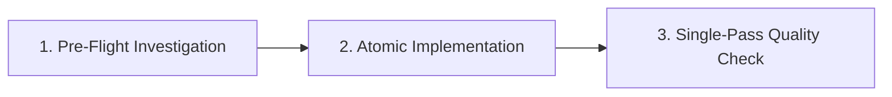

# Absensi SPPG — Aturan Workspace & AI Agent Standar Emas

Ini adalah proyek **Absensi SPPG** dengan dua workspace utama di bawah root `absensi-sppg-app`:
- `mobile/` — Tauri v2 + Next.js 16 static export + Rust SQLite + Turso LibSQL Pipeline (Android APK)
- `web-desktop/` — Next.js 16 + LibSQL (Turso Direct) + Tauri v2 Desktop (Windows/Mac/Linux)

Aturan ini bersifat **GLOBAL** untuk seluruh workspace dan wajib ditaati oleh AI Agent tanpa pengecualian.

---

## 1. 4 Pilar Fundamental Rekayasa AI Agent (The 4 Core Pillars)

### 1.1 JANGAN PERNAH BERASUMSI (Strict Verification & Zero Guesswork)
- **DILARANG KERAS** menebak atau berasumsi mengenai nama tabel, nama kolom, tipe data, constraint (NOT NULL vs NULL), format tanggal, nama domain outbox, operasi event, maupun format payload.
- **WAJIB** verifikasi langsung ke database sumber (`absensi-sppg.db`), DDL di `storage.rs`, `turso.rs`, `db-schema.ts`, `db-migrations.ts`, dan Zod validator di `sync-schema.ts`.
- Jika ada keraguan atau ambiguitas format, lakukan investigasi kode dan verifikasi ke struktur data nyata terlebih dahulu sebelum melakukan modifikasi apapun.

### 1.2 KONSERVASI STRUKTUR & ARSITEKTUR LAMA (Wajib Konfirmasi Sebelum Hapus)
- **DILARANG MENGHAPUS** atau merombak arsitektur, struktur tabel, fungsi, gateway, model data, atau alur kerja yang sudah ada dan telah dibangun dengan stabil.
- Jika ada kondisi di mana suatu arsitektur, tabel, kolom, atau fungsi **benar-benar harus dihapus atau diubah secara breaking**, AI Agent **WAJIB meminta konfirmasi dan persetujuan eksplisit dari USER terlebih dahulu**.

### 1.3 REUSE SEBELUM MEMBUAT KODE BARU (Anti-Duplikasi & Zero Redundancy)
- Sebelum menulis fungsi, query, helper, gateway, atau tipe baru, **WAJIB periksa kode yang sudah ada** di `@/lib/gateways/*`, `@/lib/services/*`, `@/lib/validations/*`, `@/types/*`, atau backend Rust (`operational.rs`, `administration.rs`, `scanner.rs`, `storage.rs`, `turso.rs`).
- **DILARANG** membuat kode duplikat, multiple redundant logic, atau fungsi boros yang fungsinya sudah tersedia.

### 1.4 LOGIKA POWERFUL, GUARD KUAT, KEAMANAN TINGGI & PERFORMA CEPAT
- **Logika Powerful & Resilient:** Tangani seluruh edge-case operasional (shift malam lintas hari, pergantian sesi fleksibel, auto-alfa, rollback proteksi, anti-double scan, rekonsiliasi ID shift/card offline).
- **Guard Kuat & Validasi Berlapis:** Validasi schema di setiap pintu masuk (Zod schema di frontend/API, parameter sanitization di Rust, boundary check di Next.js route handlers).
- **Keamanan Standar Tertinggi:** Enkripsi vault AES-256-GCM + Argon2id, dynamic RBAC, token scrubbing pada logging, HttpOnly session cookies, monotonic clock anti-time-drift.
- **Performa Cepat:** Optimasi query berindeks, in-memory caching untuk aset ID card & QR, bounded body JSON, kompresi gambar client-side (CR80 JPEG ~300KB), dekompresi gzip/brotli di Rust reqwest.

---

## 2. Matriks Anti-Pattern & Fatal Pitfalls (Pola Terlarang vs Pola Wajib)

| ❌ Pola Terlarang (Anti-Pattern) | 💥 Dampak / Risiko Fatal | ✅ Pola Wajib (Standar SPPG) |
| :--- | :--- | :--- |
| **Menebak `role_id = 1` untuk Superadmin** | Role salah jika database hasil migrasi memiliki ID berbeda | Query dinamis: `WHERE role_key = 'superadmin' AND is_superadmin = 1 AND is_active = 1` |
| **Menanam Secret URL/Token di Release Binary** | Token database dapat diekstrak pihak ketiga dari APK/Installer | `option_env!` hanya di `#[cfg(debug_assertions)]`, release wajib `None` |
| **`useEffect(() => () => stopCamera(), [state])`** | Kamera Android WebView mati seketika 0.1 detik setelah dibuka | Pisahkan unmount cleanup murni `useEffect(() => () => stopCamera(), [])` |
| **Pakai `rustls-platform-verifier` di Android** | Aplikasi Android crash seketika saat dibuka (JNI VM uninitialized) | Gunakan `webpki-roots` dan pasang provider `ring` di awal `lib.rs` |
| **Set `isMinifyEnabled = true` di Android** | R8 memotong JNI reflection Tauri dan memicu UnsatisfiedLinkError | Wajib `isMinifyEnabled = false` di `build.gradle.kts` |
| **Menghapus data lokal legacy saat cloud kosong** | Kehilangan seluruh data lokal historis customer | Cek `desktop_entity_revision` & pending outbox sebelum `delete_missing` |
| **Domain outbox acak (`company_profile`, `scan_log`)** | Event retry terus-menerus atau false-synced tanpa mutasi | Wajib gunakan 37 Canonical Hyphen Routes (`company-profile`, `log-scan`, dll.) |
| **Mutasi kosong ditandai `applied`** | Sinkronisasi tampak sukses padahal data di server tidak berubah | Jika statement mutasi kosong (`is_empty()`), tandai `conflict`/`rejected` |
| **Akses IPC mentah `invoke()` langsung dari UI React** | Logika duplikat, tidak portabel antara Desktop, Web, dan Mobile | Wajib lewat modul Gateway di `@/lib/gateways/*` via `isDesktopRuntime()` |
| **Kalkulasi gaji/pajak di JS atau pakai float `f64`** | Floating-point error & rawan manipulasi via DevTools console | Wajib kalkulasi di Rust pakai `rust_decimal`, format visual via `Intl` |
| **Hardcode tarif pajak/BPJS di kode program** | Histori laporan berubah saat regulasi pemerintah diperbarui | Simpan di `tax_rules`/`bpjs_rules` (`effective_date`) & snapshot di `payroll_runs` |
| **Bypass guard backend Rust pada Tauri command** | DevTools dapat menembak `invoke()` langsung tanpa lewat UI | Verifikasi ulang sesi dan permission operator di setiap handler Rust |
| **Pakai timestamp JavaScript untuk absensi** | Manipulasi jam perangkat oleh user dapat memalsukan kehadiran | Jam server divalidasi via hardware monotonic clock (`time_policy.rs`) |
| **Jalankan unit test berulang di tengah modifikasi** | Pemborosan waktu dan looping context tanpa arah | Test **HANYA SATU KALI** di akhir via `bun run check:quick` setelah selesai |
| **Menaruh kelas base `bg-white` di JSX untuk tema terang** | Tema gelap rusak dan menjadi terlalu terang / silau | Tulis base JSX dalam dark mode (`bg-slate-900`), kelola tema terang via `html[data-theme="light"]` di `globals.css` |
| **Tidak mengatur warna `<select option>` eksplisit** | Teks dropdown tema hilang/tidak terbaca di Windows WebView | Berikan styling warna eksplisit untuk `select option` pada dark dan light mode |
| **Menaruh `focus()` di `useEffect` dengan dependensi callback (`onClose`/`onChange`) atau tanpa guard activeElement** | Setiap pengetikan 1 karakter di input form memicu re-render parent yang merebut paksa fokus kursor (*focus stealing*) | Ikat callback prop ke `useRef` (`onCloseRef`), isolasi fokus hanya saat open transition (`[isOpen, mounted]`), dan pasang guard `!dialogRef.current?.contains(document.activeElement)` |

---

## 3. 30 Aturan Emas Arsitektur & Rekayasa (The 30 Golden Rules)

### 1. Arsitektur 2-Tier Turso & Dekompresi Payload (Reqwest Gzip/Brotli)
- Desktop dan Mobile berkomunikasi langsung ke Database Cloud LibSQL/Turso via `/v2/pipeline`.
- `reqwest` di Rust WAJIB mengaktifkan fitur `["json", "gzip", "brotli", "deflate"]` (dan `rustls` untuk Android) di `Cargo.toml`.
- Saat membaca respon pipeline Turso di `turso.rs`, WAJIB baca teks body terlebih dahulu via `response.text()` lalu parse JSON untuk menangkap cuplikan payload mentah jika terjadi error.

### 2. Keamanan Kredensial & Vault Offline Terenkripsi
- JANGAN PERNAH menyimpan plaintext credentials/token di disk atau `localStorage`.
- Kredensial database (URL & Auth Token) dan snapshot login disimpan dalam vault `secrets.rs` (AES-256-GCM + Argon2id).
- Form input token di Frontend WAJIB menyembunyikan token setelah disimpan (tampilkan placeholder tersimpan di vault).
- Saat simpan konfigurasi (`set_turso_config`), jika input token dikosongkan oleh user, sistem WAJIB mempertahankan token lama di vault tanpa menimpanya menjadi kosong.
- Snapshot kredensial diikat (*hard-bound*) dengan `server_origin` + `username` + `device_id`.

### 3. TLS & Jaringan Android (Zero Crash Standard)
- JANGAN PERNAH menggunakan `rustls-platform-verifier` — WAJIB gunakan `webpki-roots`.
- `rustls::crypto::ring::default_provider().install_default()` WAJIB dipanggil di awal fungsi `run()` di `lib.rs` sebelum inisialisasi builder Tauri.

### 4. Konfigurasi R8 / ProGuard Android
- JANGAN PERNAH mengubah `isMinifyEnabled = false` di `build.gradle.kts` — R8 akan merusak reflection JNI Tauri dan menyebabkan aplikasi crash saat dibuka.

### 5. Pola Arsitektur Hybrid Isomorphic Gateway (Universal Multi-Platform)
- **Konsep Fondasi Arsitektur:** Workspace `web-desktop` dan `mobile` dibangun dengan pola **Hybrid Isomorphic Gateway** (`@/lib/gateways/*`). Satu basis kode UI/frontend yang sama dapat berjalan secara mulus di 3 platform tanpa duplikasi kode:
  1. **Desktop (Tauri Desktop Windows/Mac/Linux):** `isDesktopRuntime() === true` mengeksekusi perintah Rust IPC (`invokeDesktop(...)`) dan beroperasi di atas SQLite lokal secara offline-first.
  2. **Mobile (Tauri Android APK):** `isDesktopRuntime() === true` mengeksekusi perintah Rust SQLite Android dengan guard hardware mobile.
  3. **Web Browser Standar (Cloud/SaaS Website):** `isDesktopRuntime() === false` secara otomatis mengalihkan request ke HTTP Route Handlers Next.js (`requestWebApi("/api/...")`) yang berkomunikasi langsung ke Database Cloud LibSQL (Turso).
- **Larangan Panggilan Mentah (No Direct Raw Invocation):**
  - JANGAN PERNAH memanggil `invoke()` atau `fetch("/api/...")` langsung dari komponen React JSX.
  - Seluruh komunikasi data WAJIB melalui gateway di `@/lib/gateways/*` dengan deteksi runtime terpusat via `isDesktopRuntime()`.

### 6. Keamanan Timestamp Waktu Absensi (Rust Monotonic Clock)
- JANGAN PERNAH mempercayai timestamp dari JavaScript/Frontend untuk pencatatan absensi.
- Backend Rust / Server LibSQL adalah satu-satunya sumber kebenaran waktu operasional dengan time-drift & rollback protection (`time_policy.rs`).

### 7. Siklus Kamera & Hardware Scanner (Android WebView)
- JANGAN PERNAH menaruh `stopCamera()` di dalam cleanup `useEffect` yang memiliki dependency state `cameraActive` atau state yang berubah saat kamera menyala.
- Pisahkan unmount cleanup `useEffect(() => () => stopCamera(), [])` murni dari event visibility `visibilitychange`.
- Selalu sediakan fallback constraints `{ video: true }` jika `facingMode: { ideal: "environment" }` gagal.

### 8. Sinkronisasi Dua Arah Tanpa Schema Drift (Zero-Drift Standard)
- Seluruh kolom dan tabel pada 4 layer WAJIB 100% IDENTIK di `web-desktop` dan `mobile`:
  1. `SNAPSHOT_TABLES` di `sync.rs` (Rust)
  2. DDL SQLite di `storage.rs` (Rust)
  3. Skema Server di `db-schema.ts` & `db-migrations.ts` (LibSQL)
  4. Validator Zod di `sync-schema.ts` (TypeScript)
- 21 Tabel Snapshot Terdistribusi (Identik di Web-Desktop dan Mobile):
  - 12 Tabel Operasional Inti: `master_data`, `id_card`, `tbl_shift`, `tbl_hari_libur`, `setting_gex_system`, `company_profile`, `id_card_template`, `backup_karyawan`, `koreksi_admin`, `import_offline`, `absensi_harian`, `log_scan`.
  - 1 Tabel Whitelist Hari Libur: `hari_libur_whitelist`.
  - 8 Tabel Payroll Engine: `salary_configs`, `overtime_tier_rules`, `payroll_components`, `tax_rules`, `bpjs_rules`, `payroll_runs`, `payroll_items`, `payroll_audit_logs`.
- `master_operator` dikelola terpisah sebagai data autentikasi/RBAC cloud dan bukan bagian dari snapshot operasional perangkat.

### 9. 37 Route Kanonik Outbox & Normalisasi Boundary
- Hanya 37 route kanonik berformat hyphen-case yang diizinkan diproduksi oleh outbox:
  `attendance/create`, `attendance/delete`, `attendance/scan`, `attendance/update`, `backup/cancel`, `backup/create`, `company-profile/update`, `correction/create`, `correction/delete`, `employee/create`, `employee/status`, `employee/token`, `employee/update`, `holiday-whitelist/create`, `holiday-whitelist/delete`, `holiday-whitelist/update`, `holiday/create`, `holiday/delete`, `holiday/update`, `id-card-template/save`, `id-card/update`, `log-scan/delete`, `offline-import/delete`, `offline-import/row`, `payroll/bpjs-rule`, `payroll/create-run`, `payroll/delete`, `payroll/overtime-rule`, `payroll/payroll-component`, `payroll/salary-config`, `payroll/tax-rule`, `payroll/transition-status`, `setting/update`, `setting/upsert`, `shift/create`, `shift/delete`, `shift/update`.
- Normalisasi alias lama (`company_profile`, `id_card_template`, `offline_import`, `scan_log`) hanya dilakukan pada boundary Turso, lalu disimpan ke changelog/receipt dalam bentuk kanonik.

### 10. Idempotensi Outbox, Monotonic Revisions & Atomic Transaksi
- `pull_snapshot` pada Turso WAJIB mengembalikan format `{ "snapshot": snapshot }`.
- Perhitungan `max_rev` dari Turso WAJIB dihitung dengan `.unwrap_or(0).max(last_revision)`.
- Saat push outbox, status `applied` pada server WAJIB menghasilkan `serverRevision > 0` via `appendChange()` (`lastInsertRowid`).
- BEGIN IMMEDIATE membungkus mutasi target + changelog + operation receipt secara atomik.
- Snapshot `apply_table` TIDAK BOLEH menimpa baris lokal yang masih berstatus `pending` / `conflict` di outbox (`row_has_unsynced_change`).

### 11. Multi-Device Concurrent Scanning Safety
- Setiap perangkat memiliki `client_id` unik dan setiap event scan menghasilkan `event_id` berbasis nanodetik + hash SHA-256.
- Penulisan ke Turso `sync_changelog` menggunakan `ON CONFLICT(event_id) DO UPDATE...` sehingga multi-perangkat dapat melakukan scan bersamaan tanpa bentrok.
- Cooldown scan (`anti_double_scan_seconds`) tetap ditegakkan di backend.

### 12. Batas Payload & Base64 Assets
- String aset besar (base64 image, logo, template JSON) WAJIB menggunakan `assetText` (maks 10MB).
- Route handler Next.js yang memproses payload besar WAJIB mengizinkan body minimum 25MB: `readJsonBody(request, 25_165_824)`.
- Selalu lakukan optimasi gambar client-side (`optimizeImageFile`) ke dimensi standar (CR80 JPEG ~300KB) sebelum dikirim.

### 13. Lokasi Database Lokal & Skrip Migrasi Idempoten
- Database lokal Desktop terletak di `%LOCALAPPDATA%\id.sppg.absensi\desktop-security.db`.
- Gunakan skrip `bun run migrate-old-db` untuk menyalin data operasional dari database lama (`absensi-sppg.db`) ke database lokal tanpa merusak skema RBAC/security.

### 14. Kompatibilitas Next.js Static Export (Tauri v2)
- Di workspace `mobile/` (yang diexport statis), route handler di `src/app/api` DILARANG mengekspor method `GET` (hanya `POST`, `PUT`, `PATCH`, `DELETE`).

### 15. Type-Safety JSX Bebas Error (Anti-TS2322)
- HINDARI `{val && <JSX />}` untuk tipe `unknown`, `number`, atau `Record`.
- Gunakan ternary eksplisit: `{Boolean(val) ? <JSX /> : null}` atau `{val ? <JSX /> : null}` dan bungkus nilai teks dengan `String(val)`.

### 16. UI/UX Layout Resiliency & Zero-Overflow
- Input stepper dan slider posisi WAJIB menggunakan CSS grid responsif dengan `min-w-0`, `truncate`, dan `overflow-hidden`.
- Saat menambahkan panel interaktif/mode fokus, JANGAN PERNAH menghilangkan fitur konfigurasi lain yang sudah ada.

### 17. Auto-Sync Background & Reaktivitas Real-Time Klien
- Setiap mutasi data lokal WAJIB mendaftarkan row ke antrean outbox (`desktop_sync_outbox`) dan memicu sinkronisasi latar belakang (`desktop_sync_now`).
- Frontend WAJIB menyertakan `AutoSyncRunner` (siklus berkala 30 detik + saat window/tab kembali aktif `focus`/`visibilitychange`) dan membroadcast event browser `sppg:sync-completed`.
- Halaman tampilan data (Dashboard, Riwayat, Rekap) WAJIB mendengarkan event `sppg:sync-completed`.
- Tombol **"Muat Ulang"** di seluruh halaman WAJIB memanggil `syncNow()` terlebih dahulu sebelum membaca ulang database lokal.

### 18. Standar Modal & Komponen Dialog Lintas Platform (Desktop & Mobile)
- **Centering & Anti-Clipping Vertikal:** Seluruh modal di Desktop dan Mobile WAJIB berposisi di tengah viewport (`flex items-center justify-center` dengan safe padding `py-6` atau `my-auto`). DILARANG menggunakan offset statis `top` berlebihan yang menyebabkan modal box terpotong di tepi atas layar (*upper-edge clipping*) pada monitor resolusi sedang/rendah atau layar mobile landscape.
- **Dynamic Viewport Bounds & Scrollability:** Kontainer modal dibatasi `max-h-[85vh]` hingga `max-h-[88vh]`, memiliki sticky header, sticky footer, dan body yang dapat di-scroll vertikal (`overflow-y-auto`, `overscroll-contain`, `touch-pan-y` di mobile).
- **Kontras Elemen Form & Dropdown Bersarang:** Elemen `<select>` dan `<option>` di dalam modal WAJIB memiliki styling warna eksplisit di tema terang (`bg-white text-slate-900`) dan tema gelap (`bg-slate-900 text-slate-100`) untuk mencegah teks dropdown tak terbaca/putih di atas putih pada WebView Windows maupun WebView Android.
- **Aksesibilitas & Keyboard Navigation:** Mengikuti aturan Biome a11y: DILARANG meletakkan `onClick` pada elemen `div` statis tanpa role/key handler; gunakan keyboard listener `Escape` pada dialog container.
- **Focus Management Anti-Stealing & Stabilisasi Callback (`useRef`):** Prop callback parent (seperti `onClose`, `onSubmit`, `onChange`) yang diteruskan ke komponen modal/wrapper WAJIB diikat menggunakan `useRef` (`onCloseRef.current = onClose`) agar perubahan referensi fungsi inline pada saat form re-render TIDAK memicu eksekusi ulang `useEffect`. DILARANG memanggil `.focus()` di dalam efek yang bergantung pada callback prop. Pemindahan fokus dialog hanya boleh terjadi sekali saat modal transisi buka (`[isOpen, mounted]`) dan WAJIB diproteksi guard `if (dialogRef.current && !dialogRef.current.contains(document.activeElement))`. Saat modal unmount/tutup, kembalikan fokus ke elemen pemanggil (`previousActiveElement?.focus()`).

### 19. Standar Geofencing & GPS 0ms Caching
- Scan absensi di mobile/desktop WAJIB memanfaatkan in-memory caching GPS (60s TTL) melalui `watchCoordinates()` / `getCachedCoordinates()` untuk respon scan 0ms tanpa blocking GPS hardware query.
- Jika geofence aktif dan GPS di luar radius kantor: tolak scan secara ramah, tetap catat ke `log_scan` untuk audit, dan jangan membuat baris `absensi_harian`.

### 20. Otomasi Generate Alfa pada Arsitektur 2-Tier
- Eksekusi Alfa harian otomatis dijalankan via `AutoAlfaRunner` setiap 5 menit dengan bypass hari libur (`tbl_hari_libur`). Shift fleksibel TIDAK di-bypass: jendelanya berakhir di akhir hari kalender sehingga yang dinilai adalah H-1.
- Setiap row Alfa yang dibuat di SQLite lokal WAJIB didaftarkan ke `desktop_sync_outbox` (domain: `attendance`, operation: `create`) agar otomatis terdorong ke Turso Cloud.

### 21. Bootstrap Superadmin & Kesetaraan Dev/Release
- Mode `tauri:dev`, desktop installer, dan APK Android DILARANG memiliki kredensial bawaan default.
- Release DILARANG mengompilasi URL/Token database dari mesin build ke binary release (`option_env!` hanya di debug).
- Database cloud tanpa Superadmin wajib menampilkan provisioning atomik: pilih sendiri username dan password kuat (min 12 char, uppercase, lowercase, number, symbol).

### 22. Proteksi Cloud Kosong (Empty-Cloud Safety)
- Snapshot `delete_missing` HANYA BOLEH menghapus baris lokal yang terbukti memiliki `desktop_entity_revision`.
- Data lokal legacy tanpa revision cloud tidak boleh dihapus oleh database cloud yang masih kosong.
- Bulk seed cloud harus menjadi aksi eksplisit dengan preview/konflik policy, bukan auto-upload tersembunyi.

### 23. Presisi Finansial & Snapshot Aturan Payroll (PPh 21 TER, BPJS, `rust_decimal`)
- **Presisi Mutlak:** DILARANG menggunakan tipe float (`f64` / `number`) untuk kalkulasi gaji/pajak; WAJIB gunakan `rust_decimal` di Rust.
- **PPh 21 (TER & Pasal 17):** Pemotongan bulanan (Jan–Nov) via TER Kategori A/B/C sesuai PTKP, rekonsiliasi Desember via tarif progresif 5 lapis Pasal 17 UU HPP.
- **Snapshot Aturan Dinamis:** Tarif pajak/BPJS disimpan di `tax_rules`/`bpjs_rules` dengan kolom `effective_date`. Setiap eksekusi `payroll_runs` WAJIB mengunci snapshot tarif agar data masa lalu tidak berubah saat regulasi diperbarui.

### 24. Layered Guard & Defensive IPC Backend
- **Guard Berlapis:** Frontend `<AuthGuard>` + Hook `useRole()` di UI, verifikasi sesi dan permission operator di setiap handler Rust `#[tauri::command]`, dan integritas schema di database (`UNIQUE`, `CHECK`, Foreign Keys).
- **Idempotency Guard:** Proses finansial, generate alfa, dan koreksi admin wajib menyertakan `idempotency_key` untuk mencegah double-execution saat request ganda.
- **State Machine Approval:** Alur status dokumen (Draft -> Submitted -> Reviewed -> Approved -> Paid) dikelola via `enum` Rust dan pencatatan audit log immutable.

### 25. Stack Visual 3D Resmi & Paritas Dua Workspace
- Upgrade UI/UX immersive hanya boleh memakai 8 kategori tool: **3D Rendering** (`three` + `@react-three/fiber` v9+ + `@react-three/drei`), **No-Code 3D** (`@splinetool/react-spline`), **Pseudo-3D & Animasi UI** (`motion`/Framer Motion), **Animasi Mikro & Status** (`@rive-app/react-canvas`), **Komponen Visual Modern** (Aceternity UI & Magic UI, di-vendor bukan npm), **Deteksi Hardware** (`detect-gpu`), **Kompresi Aset** (Draco / `@gltf-transform/*`, devDependency saja), dan **State Bridge** (`zustand`).
- Paket lain (GSAP, Lottie, Babylon.js, PixiJS, react-spring) DILARANG tanpa persetujuan eksplisit USER.
- Paket runtime WAJIB dipasang di kedua workspace dengan versi pinned identik. Komponen bersama ditulis di `web-desktop/src/components/visual/` dan store di `web-desktop/src/lib/stores/`, lalu didaftarkan ke `dirsToCopy` pada `mobile/scripts/sync-frontend-lib.ts` (script itu default-nya tidak menyalin `src/components`).

### 26. Aset Visual Offline-First (Zero CDN) & Prasyarat CSP
- Seluruh `.glb`/`.splinecode`/`.riv`/`.wasm`, decoder Draco/KTX2, tekstur, dan benchmark `detect-gpu` WAJIB di-bundle di `public/3d/` dan dirujuk path relatif. DILARANG KERAS memuat dari CDN manapun.
- Default CDN bawaan paket WAJIB ditutup eksplisit: `RuntimeLoader.setWasmUrl("/3d/rive/rive.wasm")`, `getGPUTier({ benchmarksURL: "/3d/benchmarks" })`, decoder path Draco lokal, dan scene Spline lokal.
- Model mentah WAJIB melewati `gltf-transform optimize` (Draco/KTX2). Anggaran 2 MB per scene Desktop / 800 KB Mobile.
- Prasyarat CSP (wajib konfirmasi USER lebih dulu): `connect-src` Desktop perlu `'self' asset: http://asset.localhost`, dan WASM perlu `script-src` dengan `'wasm-unsafe-eval'`. DILARANG menambah host eksternal atau `'unsafe-eval'`.

### 27. Gerbang `detect-gpu`, Guard WebGL & Kontensi Hardware
- Menebak kemampuan GPU perangkat customer melanggar prinsip anti-asumsi. `detect-gpu` dijalankan sekali saat start, dipetakan ke tier `high|medium|low|off`, di-cache, dan bisa ditimpa manual. Deteksi gagal = default `low`, bukan `high`.
- Guard WebGL nyata + fallback 2D tetap wajib; layar putih bukan fallback. Maksimal satu konteks WebGL aktif; unmount WAJIB `dispose()` + `gl.dispose()` + `forceContextLoss()`.
- DILARANG KERAS memount `<Canvas>`/Spline di halaman Scanner saat kamera aktif (panas, frame drop, stream kamera mati). Scanner hanya boleh efek Motion/CSS 2D.
- Scene statis wajib `frameloop="demand"`, loop berhenti saat `visibilitychange`/blur, auto turun tier bila FPS di bawah target 3 detik berturut-turut. Mobile: `dpr` maks `[1, 1.5]`, `antialias: false`, `shadows={false}`.

### 28. Preferensi Visual Device-Local, A11y & State Bridge Zustand
- Tier visual disimpan hanya di `localStorage` (`sppg.visual.tier`). DILARANG KERAS menyimpannya di `setting_gex_system`/tabel tersinkron, dan DILARANG menambah kolom, domain outbox, atau route kanonik demi keperluan visual.
- `prefers-reduced-motion` WAJIB dihormati; animasi DILARANG menjadi satu-satunya penyampai status (wajib ada teks/`aria-label`).
- Zustand hanya jembatan state visual: DILARANG menjadi sumber kebenaran data bisnis (tetap lewat Gateway) dan DILARANG memanggil `set()` di dalam `useFrame`. Store direset saat logout.
- Indikator Rive WAJIB mencerminkan status nyata (`push_error`, `sppg:sync-completed`, outbox `pending`/`conflict`) — dilarang menampilkan animasi sukses saat push gagal.
- Warna wajib memakai token `--app-*` (uji tema gelap dan terang); animasi Tailwind lewat `@theme` di `globals.css` (Tailwind v4, DILARANG membuat `tailwind.config.ts`).
- Detail lengkap: `.agents/skills/absensi-sppg-rules/references/07-immersive-3d-ui-ux.md`.

### 29. Standar Harmonisasi Tema Terang & Gelap (Light/Dark Mode Parity & Zero-Conflict)
- **Dark Mode sebagai Base Default JSX:** Seluruh komponen JSX WAJIB menggunakan kelas styling dasar mode gelap (`bg-slate-900`, `bg-slate-950`, `text-white`, `text-slate-400`, `border-white/10`, `border-slate-800`). **DILARANG** menaruh kelas base terang inline (seperti `bg-white dark:bg-slate-900` atau `text-slate-900 dark:text-white`) langsung di komponen JSX karena akan merusak estetika gelap dan membuat dark mode menjadi terlalu terang atau silau.
- **Tema Terang Dikelola Terpusat via `globals.css`:** Transisi ke tema terang (`html[data-theme="light"]` dan `html.light`) dikelola secara terpusat dan rapi di `globals.css` (kartu modul menjadi `#ffffff`, border `#e2e8f0`, judul `#0f172a`, teks `#475569`, tab switcher `#f1f5f9`).
- **Kelengkapan Whitelist Opacity Kontainer:** Seluruh varian opacity kontainer gelap (`.bg-slate-900\/98`, `.bg-slate-900\/95`, `.bg-slate-900\/90`, `.bg-slate-950\/96`, dll.) WAJIB terdaftar lengkap di Bagian 3 `globals.css` agar kontainer tidak tertinggal berwarna gelap saat tema terang aktif.
- **Aturan Pembalikan Teks Aksen (Symmetric Tone Inversion):**
  - Teks aksen bernilai terang di mode gelap (`text-amber-100`, `text-amber-200`, `text-sky-100`, `text-rose-100`, `text-emerald-100`) **WAJIB dibalik secara simetris** menjadi warna pekat/kontras tinggi di tema terang:
    - Amber/Kuning: `#78350f` (amber-900) atau `#92400e` (amber-800). Dilarang keras membiarkan teks kuning pucat di atas kartu terang.
    - Merah/Rose: `#9f1239` (rose-800) atau `#be123c` (rose-700).
    - Hijau/Emerald: `#14532d` (emerald-900) atau `#15803d` (emerald-700).
    - Biru/Sky: `#075985` (sky-800) atau `#0369a1` (sky-700).
- **Semantik Mandiri pada Elemen Kritis (Recovery, Badge, Modal, Callout):**
  - Elemen penting seperti pil kode pemulihan (`.bootstrap-recovery-code`, `.recovery-code-pill`), panel bootstrap (`.bootstrap-panel-card`), dan kartu status khusus WAJIB diberi kelas semantik dan diatur eksplisit di `globals.css` untuk kedua tema agar tidak bergantung pada cascading generik yang rapuh.
- **Paritas Mesin Tema Desktop vs Mobile:**
  - `web-desktop` menggunakan override kelas utilitas di `globals.css`.
  - `mobile` menggunakan pembalikan variabel warna di `:root[data-theme="light"]` (`--color-slate-*`, `--color-amber-100: #78350f`, `--color-amber-200: #92400e`). Keduanya wajib sinkron agar APK dan Desktop memiliki kontras dan estetika yang identik.
- **Kontras Elemen Form & Dropdown (`<select>` & `<option>`):** Elemen form native `<select>` dan `<option>` WAJIB memiliki styling eksplisit warna latar dan teks di kedua tema (`bg-slate-900 text-slate-100` di dark mode, `bg-white text-slate-900` di light mode) untuk mencegah teks dropdown tak terbaca/putih di atas putih pada WebView/Chromium Windows.
- **Kontras Tinggi Tab Segmented & Action Controls:** Tombol segmented switcher tema maupun tab modul WAJIB mempertahankan kontras teks tinggi (`font-bold`, status aktif dengan gradient/sky kontras kuat, status inaktif dengan warna kontras `text-slate-400` / `text-slate-300`).
- **Hero & Command Center Bersih & Lapang:** Halaman Home/Hero mengutamakan keterbacaan data operasional, jam digital, tanggal Indonesia, dan aksi cepat; hindari pemakaian scene 3D berputar yang berat/mengganggu di hero section utama.

### 30. Paritas Dua Workspace (Web-Desktop & Mobile) & Siklus Sinkronisasi Modul
- **Dua Workspace Resmi:**
  - `web-desktop/`: Next.js 16 + LibSQL (Turso Direct) + Tauri v2 Desktop (Windows/Mac/Linux).
  - `mobile/`: Next.js 16 (Static Export `output: 'export'`) + Tauri v2 Android (APK arm64/armv7) + Rust SQLite lokal + Turso LibSQL Pipeline.
- **Single Source of Truth untuk Shared Modules:**
  - Modul bisnis bersama (`@/lib/gateways/*`, `@/lib/validations/*`, `@/lib/services/*`, `@/types/*`, dan komponen visual bersama) ditulis terlebih dahulu di `web-desktop/` sebagai sumber kebenaran (*source of truth*).
  - Penyelarasan ke workspace `mobile/` WAJIB menggunakan skrip sinkronisasi: `bun mobile/scripts/sync-frontend-lib.ts` (atau `cd mobile && bun run sync:lib`). Dilarang keras membuat logika bercabang (*divergent logic*) yang tidak terdokumentasi di antara kedua workspace.
- **Disiplin Static Export pada Mobile API:**
  - Karena `mobile/` menggunakan `output: 'export'`, seluruh route handler di `mobile/src/app/api` DILARANG mengekspor method `GET` (hanya `POST`, `PUT`, `PATCH`, `DELETE`).
- **Verifikasi Kontrak Seluruh Workspace:**
  - Setiap perubahan arsitektur, gateway, DDL, atau skema WAJIB diverifikasi menyeluruh melalui `bun run check:quick` di root proyek untuk memastikan kedua workspace tetap 100% konsisten, bebas drift, dan lulus linter Biome & TypeScript.

---

## 4. Protokol AI Agent 3-Tahap (3-Stage Workflow)



1. **Tahap 1 (Pre-Flight):** Investigasi kode, periksa DDL `storage.rs`, `db-schema.ts`, `sync-schema.ts`, dan pastikan tidak berasumsi.
2. **Tahap 2 (Implementation):** Terapkan logika defensif, Zod validation, `BEGIN IMMEDIATE`, lifecycle camera decoupling, dan reuse gateway yang ada.
3. **Tahap 3 (Post-Flight):** Jalankan **SATU KALI** `bun run check:quick` di root workspace sebelum memberikan laporan final kepada User.

---

## 5. Referensi Command Wajib

```powershell
# Quick Check komprehensif seluruh workspace (Skema + Kontrak + TS + Biome)
cd e:\Freelance\absensi-sppg-app && bun run check:quick

# Full Check seluruh workspace (termasuk Rust Cargo Tests)
cd e:\Freelance\absensi-sppg-app && bun run check

# Audit Kontrak Sync & Bootstrap
cd e:\Freelance\absensi-sppg-app && bun .agents/skills/absensi-sppg-rules/scripts/audit-sync-contract.ts

# Reset Password Superadmin / Bersihkan Rate Limit
cd e:\Freelance\absensi-sppg-app && bun run reset:superadmin
```

---

## 6. Standar Gaya Komunikasi AI Agent (Clean & Professional Response)

- **DILARANG MENGGUNAKAN SIMBOL/EMOJI/IKON DEKORATIF** dalam respon chat kepada pengguna (misalnya: tidak boleh menggunakan emoji atau ikon seperti lambang api, checklist warna-warni, lampu, kunci pas, otak, kaca pembesar, dll.).
- **Tampilan Bersih & Rapi:** Gunakan format teks standar markdown yang bersih (heading `#`, `##`, `###`, poin tanda hubung `-`, penomoran `1.`, teks tebal `**`, dan blok kode fenced).
- **Hanya gunakan ikon jika pengguna secara eksplisit meminta** (misal: "tambah icon" / "pakai simbol").

