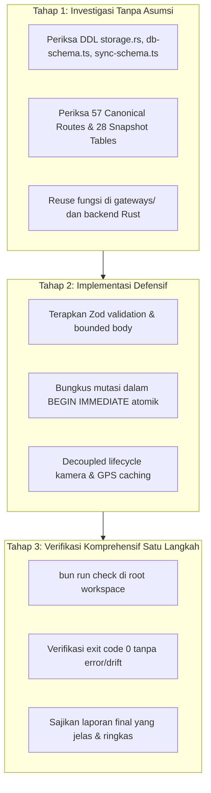

# Absensi SPPG — Panduan Komprehensif Arsitektur & Koding

Dokumen ini adalah **standar tertinggi (Golden Standard)** pengembangan pada proyek **Absensi SPPG**. Setiap baris kode yang ditulis wajib mematuhi seluruh panduan, kontrak arsitektur, dan aturan dalam dokumen ini tanpa terkecuali.

---

## 1. Ringkasan Arsitektur & Komponen

| Komponen | Target Platform | Teknologi Utama | Direktori |
| :--- | :--- | :--- | :--- |
| **mobile** | Android APK | Tauri v2 + Next.js 16 (Static Export) + Rust (SQLite + Turso Pipeline + ring) | `mobile/` |
| **web-desktop** | Web Server & Desktop (Win/Mac/Linux) | Next.js 16 (Node/Edge) + LibSQL (Turso Direct) + Tauri v2 | `web-desktop/` |
| **Shared Core** | Validasi, Sync, Types | TypeScript 5, Zod 4, Biome 2, Bun 1.3 | Kedua Workspace |

---

## 2. 4 Pilar Fundamental Rekayasa AI Agent (The 4 Core Pillars)

### 2.1 JANGAN PERNAH BERASUMSI (Strict Verification & Zero Guesswork)
- **DILARANG KERAS** menebak atau berasumsi mengenai nama tabel, nama kolom, tipe data, constraint (NOT NULL vs NULL), format tanggal, nama domain outbox, operasi event, maupun format payload.
- **WAJIB** verifikasi langsung ke database sumber (`absensi-sppg.db`), DDL di `storage.rs`, `turso.rs`, `db-schema.ts`, `db-migrations.ts`, dan Zod validator di `sync-schema.ts`.
- Jika ada keraguan atau ambiguitas format, lakukan investigasi kode dan verifikasi ke struktur data nyata terlebih dahulu sebelum melakukan modifikasi apapun.

### 2.2 KONSERVASI STRUKTUR & ARSITEKTUR LAMA (Wajib Konfirmasi Sebelum Hapus)
- **DILARANG MENGHAPUS** atau merombak arsitektur, struktur tabel, fungsi, gateway, model data, atau alur kerja yang sudah ada dan telah dibangun dengan stabil.
- Jika ada kondisi di mana suatu arsitektur, tabel, kolom, atau fungsi **benar-benar harus dihapus atau diubah secara breaking**, AI Agent **WAJIB meminta konfirmasi dan persetujuan eksplisit dari USER terlebih dahulu**.

### 2.3 REUSE SEBELUM MEMBUAT KODE BARU (Anti-Duplikasi & Zero Redundancy)
- Sebelum menulis fungsi, query, helper, gateway, atau tipe baru, **WAJIB periksa kode yang sudah ada** di `@/lib/gateways/*`, `@/lib/services/*`, `@/lib/validations/*`, `@/types/*`, atau backend Rust (`operational.rs`, `administration.rs`, `scanner.rs`, `storage.rs`, `turso.rs`).
- **DILARANG** membuat kode duplikat, multiple redundant logic, atau fungsi boros yang fungsinya sudah tersedia.

### 2.4 LOGIKA POWERFUL, GUARD KUAT, KEAMANAN TINGGI & PERFORMA CEPAT
- **Logika Powerful & Resilient:** Tangani seluruh edge-case operasional (shift malam lintas hari, pergantian sesi fleksibel, auto-alfa, rollback proteksi, anti-double scan, rekonsiliasi ID shift/card offline).
- **Guard Kuat & Validasi Berlapis:** Validasi schema di setiap pintu masuk (Zod schema di frontend/API, parameter sanitization di Rust, boundary check di Next.js route handlers).
- **Keamanan Standar Tertinggi:** Enkripsi vault AES-256-GCM + Argon2id, dynamic RBAC, token scrubbing pada logging, HttpOnly session cookies, monotonic clock anti-time-drift.
- **Performa Cepat:** Optimasi query berindeks, in-memory caching untuk aset ID card & QR, bounded body JSON, kompresi gambar client-side (CR80 JPEG ~300KB), dekompresi gzip/brotli di Rust reqwest.

---

## 3. Matriks Anti-Pattern & Fatal Pitfalls

| Pola Terlarang (Anti-Pattern) | Dampak / Risiko Fatal | Pola Wajib (Standar SPPG) |
| :--- | :--- | :--- |
| **Menebak `role_id = 1` untuk Superadmin** | Role salah jika database hasil migrasi memiliki ID berbeda | Query dinamis: `WHERE role_key = 'superadmin' AND is_superadmin = 1 AND is_active = 1` |
| **Menanam Secret URL/Token di Release Binary** | Token database dapat diekstrak pihak ketiga dari APK/Installer | `option_env!` hanya di `#[cfg(debug_assertions)]`, release wajib `None` |
| **`useEffect(() => () => stopCamera(), [state])`** | Kamera Android WebView mati seketika 0.1 detik setelah dibuka | Pisahkan unmount cleanup murni `useEffect(() => () => stopCamera(), [])` |
| **Pakai `rustls-platform-verifier` di Android** | Aplikasi Android crash seketika saat dibuka (JNI VM uninitialized) | Gunakan `webpki-roots` dan pasang provider `ring` di awal `lib.rs` |
| **Set `isMinifyEnabled = true` di Android** | R8 memotong JNI reflection Tauri dan memicu UnsatisfiedLinkError | Wajib `isMinifyEnabled = false` di `build.gradle.kts` |
| **Menghapus data lokal legacy saat cloud kosong** | Kehilangan seluruh data lokal historis customer | Cek `desktop_entity_revision` & pending outbox sebelum `delete_missing` |
| **Domain outbox acak (`company_profile`, `scan_log`)** | Event retry terus-menerus atau false-synced tanpa mutasi | Wajib gunakan Canonical Hyphen Routes dari `CANONICAL_SYNC_ROUTES` di `sync.rs` (`company-profile`, `log-scan`) |
| **Mutasi kosong ditandai `applied`** | Sinkronisasi tampak sukses padahal data di server tidak berubah | Jika statement mutasi kosong (`is_empty()`), tandai `conflict`/`rejected` |
| **Akses IPC mentah `invoke()` langsung dari UI React** | Logika duplikat, tidak portabel antara Desktop, Web, dan Mobile | Wajib lewat modul Gateway di `@/lib/gateways/*` via `isDesktopRuntime()` |
| **Pakai timestamp JavaScript untuk absensi** | Manipulasi jam perangkat oleh user dapat memalsukan kehadiran | Jam server divalidasi via hardware monotonic clock (`time_policy.rs`) |
| **Jalankan unit test berulang di tengah modifikasi** | Pemborosan waktu dan looping context tanpa arah | Test HANYA SATU KALI di akhir via `bun run check:quick` setelah selesai |
| **Muat aset 3D/WASM dari CDN (unpkg, `prod.spline.design`)** | Aplikasi offline-first gagal render dan request diblokir CSP Tauri | Bundle `.glb`/`.riv`/`.wasm`/benchmark di `public/3d/` dengan path relatif |
| **Import `three`/R3F di server component atau `src/lib/*` tersinkron** | Build `output: "export"` pecah dan bundle mobile membengkak | `"use client"` + `dynamic(..., { ssr: false })` di `src/components/visual/` |
| **Mount `<Canvas>` 3D saat kamera scanner aktif** | GPU dan kamera berebut resource: panas, frame drop, stream kamera mati | Halaman Scanner hanya boleh efek Motion/CSS 2D tanpa konteks WebGL |
| **Menebak kemampuan GPU perangkat customer** | HP Android murah / laptop kantor lag berat atau menampilkan layar putih | Gerbang `detect-gpu` + guard WebGL, default aman `low` saat deteksi gagal |
| **Simpan preferensi kualitas visual di `setting_gex_system`** | Preferensi per-perangkat ikut tersinkron dan merusak kontrak device-local | Device-local di `localStorage` kunci `sppg.visual.tier` |
| **Menaruh kelas base `bg-white` di JSX untuk tema terang** | Tema gelap rusak dan menjadi terlalu terang / silau | Tulis base JSX dalam dark mode (`bg-slate-900`), kelola tema terang via `html[data-theme="light"]` di `globals.css` |
| **Tidak mengatur warna `<select option>` eksplisit** | Teks dropdown tema hilang/tidak terbaca di Windows WebView | Berikan styling warna eksplisit untuk `select option` pada dark dan light mode |
| **Menaruh `focus()` di `useEffect` dengan dependensi callback (`onClose`/`onChange`) atau tanpa guard activeElement** | Setiap pengetikan 1 karakter di input form memicu re-render parent yang merebut paksa fokus kursor (*focus stealing*) | Ikat callback prop ke `useRef` (`onCloseRef`), isolasi fokus hanya saat open transition (`[isOpen, mounted]`), dan pasang guard `!dialogRef.current?.contains(document.activeElement)` |
| **Tabel snapshot absen di `SNAPSHOT_SOURCES` (turso.rs:625)** | Klien tidak pernah menarik data dari cloud dan trigger `sync_pulse` tidak dipasang di cloud (perubahan Web tidak memicu sync) | Daftarkan seluruh 32 tabel ke `SNAPSHOT_SOURCES` di `turso.rs` dan `SNAPSHOT_TABLES` di `sync.rs` secara identik |
| **QR scanner hanya berisi `id` tanpa token (`save_teacher`/`save_student` tidak mengisi `token_absensi`)** | Pemindai menolak scan dengan error "Format QR tidak valid" karena scanner mewajibkan format `id\|token` | Generate `token_absensi` acak saat membuat personil, simpan `qr_code = format!("{id}\|{token}")` ke `master_data` |
| **Memasang `UNIQUE` constraint pada tabel tersinkron** | Dua perangkat mendaftarkan data sama secara offline memicu outbox status `failed` permanen (`next_retry_at = NULL`) | Hindari `UNIQUE` selain PK di DDL; tegakkan keunikan di lapisan aplikasi (`assert_unique`) |
| **Hapus data anak tanpa update `master_data` (`delete_student` hanya hapus `siswa_data`)** | Personil nonaktif hidup kembali saat pull snapshot cloud ("zombie resurrection") | Mutasi relasional WAJIB atomik: set `master_data.status_aktif = 'Nonaktif'` dan sinkronkan perubahan status ke cloud |
| **Toggle status aktif tunggal tanpa mematikan baris lama di cloud** | Terjadi dua baris `is_aktif = 1` secara bersamaan di cloud | Handler cloud wajib idempoten: `UPDATE ... SET is_aktif = 0 WHERE id <> ?` saat mengaktifkan baris |
| **Melucuti / me-whitelist audit kontrak (`audit-sync-contract.ts`) demi kelulusan semu** | Crash runtime saat frontend mobile memanggil command Rust yang tidak terdaftar di biner mobile | Kurung pemanggil mobile dengan `if (isMobileRuntime())` di gateway, jangan pernah melonggarkan skrip audit |
| **Halaman privat tanpa route guard (`canAccessArea`)** | Pengguna unauthorized dapat mengakses direktori privat via direct URL | Pasang `if (!canAccessArea(user, area)) redirect("/forbidden");` di setiap halaman private |
| **Zod schema memakai `.passthrough()` dan melonggarkan tipe** | Nilai cacat lolos validasi lalu gagal permanen di CHECK constraint cloud | Gunakan `.strict()`, validasi enum persis CHECK constraint, dan validasi nested object secara ketat |
| **Memanggil Tauri IPC dengan snake_case (`{ id_rombel }`)** | Tauri v2 memetakan ke camelCase sehingga nilai menjadi `None` secara diam-diam tanpa error | Panggil dengan camelCase dari frontend JS/TS (`{ idRombel }`) |
| **String slice mentah `&id[4..10]` di Rust** | Panic saat string kurang dari 10 byte atau indeks memotong boundary karakter UTF-8 | Gunakan iterator aman: `id.chars().skip(4).take(6).collect::<String>()` |
| **Menulis ulang regex normalisasi WhatsApp di halaman UI** | Format nomor tidak standar dan tautan wa.me rusak | Gunakan modul kanonik terpusat `src/lib/operators/contact.ts` |
| **Menyatakan fase selesai hanya dengan `check:quick`** | Bug kompilasi Rust dan 20+ command baru tidak terdeteksi | Jalankan `bun run check` (mencakup `cargo test` kedua workspace) sebelum checkpoint selesai |

---

## 4. 29 Prinsip Emas Arsitektur (The 29 Golden Rules)

### 4.1 Arsitektur 2-Tier LibSQL & Dekompresi Reqwest (Gzip/Brotli)
- Desktop dan Mobile berkomunikasi langsung ke Database LibSQL via `/v2/pipeline`.
- Endpoint itu boleh berupa **Turso Cloud terkelola** atau **server libSQL milik pengguna sendiri** (`sqld` / `libsql-server`) di komputer kantor, NAS, mesin LAN, atau VPS. Keduanya berbicara protokol Hrana HTTP yang sama, sehingga klien Rust tidak berubah — yang berbeda hanya aturan validasi alamat.
- Provider disimpan **eksplisit** pada `TursoConfig.provider` (`turso` | `self_hosted` | `local_file`), DILARANG ditebak dari bentuk URL: menebaknya membuat satu salah ketik `http://` pada URL Turso ikut melonggarkan aturan transport.
- `local_file` adalah Mode Database Lokal: transportnya ditukar ke `LocalTransport` (`sql_backend.rs`), SQL-nya TIDAK — `ensure_schema()` yang sama membangun cloud maupun berkas lokal. Perangkat memegang DUA berkas terpisah (`desktop-security.db` operasional, `sppg-hub.db` sebagai cloud), dan hub hanya terisi lewat `push_outbox`. Karena ekspor cadangan dan promosi ke cloud sama-sama membaca hub, mesin sinkronisasi TETAP wajib berjalan di mode ini.
- `reqwest` di Rust WAJIB mengaktifkan fitur `["json", "gzip", "brotli", "deflate"]` (dan `rustls` untuk Android) di `Cargo.toml`.
- Di `turso.rs`, selalu baca teks respon terlebih dahulu via `response.text()` lalu parse JSON untuk menangkap cuplikan mentah jika terjadi error parsing.

### 4.2 Keamanan Kredensial, Vault Terenkripsi & Retensi Token
- **DILARANG KERAS** menyimpan plaintext credentials, token, password, atau salt mentah di disk / `localStorage`.
- Kredensial database (URL & Auth Token) dan snapshot login diamankan dalam modul vault `secrets.rs` menggunakan enkripsi **AES-256-GCM** dengan kunci derivasi **Argon2id**.
- **Retensi Token pada Simpan:** Pada form input pengaturan, token tidak diekspos dalam plaintext setelah tersimpan. Saat fungsi `set_turso_config` dijalankan dengan token kosong, sistem WAJIB mempertahankan token lama dari vault tanpa menimpanya menjadi string kosong.
- Snapshot kredensial diikat kuat (*hard-bound*) dengan kombinasi: `server_origin` + `username` + `device_id`. Snapshot dari origin berbeda HARUS ditolak.

### 4.3 TLS & Jaringan Android WebView (Zero Crash Standard)
- **DILARANG** menggunakan `rustls-platform-verifier`.
- **WAJIB** gunakan **`webpki-roots`**.
- `rustls::crypto::ring::default_provider().install_default()` **WAJIB** dipanggil di awal fungsi `run()` di `lib.rs` SEBELUM builder Tauri dibuat.
- Aturan transport bergantung pada provider yang dipilih pengguna (`normalize_database_url` di `turso.rs`):
  - **Turso Cloud** wajib HTTPS. HTTP hanya diizinkan untuk host jaringan privat pada debug build (`turso dev` lokal).
  - **Server Database Sendiri** boleh memakai HTTP polos ke host jaringan privat (loopback, RFC1918/RFC4193, link-local, `10.0.2.2`, `*.local`/`*.lan`/`*.internal`) pada build rilis sekalipun — paket tidak pernah meninggalkan LAN pengguna.
  - Alamat **publik ber-HTTP** tetap ditolak untuk kedua provider, kecuali pengguna secara sadar mencentang `allow_insecure_transport` di formulir. Tanpa itu, Auth Token dan data absensi akan melintasi internet sebagai teks biasa.
- Auth Token wajib untuk Turso Cloud dan untuk server sendiri yang ber-HTTPS publik. Server libSQL di jaringan privat boleh berjalan tanpa autentikasi, sehingga token kosong di sana adalah nilai akhir yang sah — bukan error.
- `sqld` di balik reverse proxy wajib dipetakan pada root origin: `normalize_database_url` membuang path/query/fragment karena seluruh pemanggil menambahkan `/v2/pipeline` sendiri.
- Klien Mobile memverifikasi TLS memakai `webpki-roots`, sehingga server sendiri ber-HTTPS wajib memakai sertifikat dari CA publik (misalnya Caddy/Let's Encrypt). Sertifikat self-signed belum didukung — pakai HTTP di LAN atau TLS ber-CA publik.

### 4.4 R8 / ProGuard Minification Rules (Android)
- **DILARANG PERNAH** mengaktifkan `isMinifyEnabled = true` di `build.gradle.kts` — R8 akan memotong reflection JNI Tauri dan menyebabkan aplikasi crash saat dibuka.
- Aturan `proguard-rules.pro` WAJIB mempertahankan:
  ```pro
  -keep class app.tauri.** { *; }
  -keep class id.sppg.absensi.mobile.** { *; }
  ```

### 4.5 Pola Arsitektur Hybrid Isomorphic Gateway (Universal Multi-Platform)
- **Konsep Fondasi Arsitektur:** Workspace `web-desktop` dan `mobile` dibangun dengan pola **Hybrid Isomorphic Gateway** (`@/lib/gateways/*`). Satu basis kode UI/frontend yang sama dapat berjalan secara mulus di 3 platform tanpa duplikasi kode:
  1. **Desktop (Tauri Desktop Windows/Mac/Linux):** `isDesktopRuntime() === true` mengeksekusi perintah Rust IPC (`invokeDesktop(...)`) dan beroperasi di atas SQLite lokal secara offline-first.
  2. **Mobile (Tauri Android APK):** `isDesktopRuntime() === true` mengeksekusi perintah Rust SQLite Android dengan guard hardware mobile.
  3. **Web Browser Standar (Cloud/SaaS Website):** `isDesktopRuntime() === false` secara otomatis mengalihkan request ke HTTP Route Handlers Next.js (`requestWebApi("/api/...")`) yang berkomunikasi langsung ke Database Cloud LibSQL (Turso).
- **Larangan Panggilan Mentah (No Direct Raw Invocation):**
  - **DILARANG** memanggil `invoke()` atau `fetch("/api/...")` langsung dari dalam komponen React UI.
  - Semua akses data WAJIB melalui modul gateway di `src/lib/gateways/*.ts` yang mengevaluasi `isDesktopRuntime()`.

### 4.6 Integritas Waktu Absensi (Rust Hardware Monotonic Clock)
- **DILARANG** mempercayai timestamp tanggal/waktu dari JavaScript client untuk pencatatan absensi.
- Jam referensi berasal dari server/cloud yang divalidasi dengan monotonic hardware clock lokal di `time_policy.rs` untuk mendeteksi rollback / manipulasi jam perangkat pengguna (toleransi step-back maks 5 menit).

### 4.7 Siklus Kamera & Scanner QR Hardware (Android WebView)
- **Pemisahan Siklus Hidup (Decoupled Lifecycle):**
  - **DILARANG** menaruh `stopCamera()` di dalam cleanup `useEffect` yang memiliki dependency state `cameraActive`.
  - Cleanup unmount komponen dibuat dalam `useEffect` terpisah dengan dependency array kosong `[]`.
  - Listener `visibilitychange` dibuat dalam `useEffect` terpisah dengan dependency `[stopCamera]` murni tanpa dependency state.
- **Fallback Constraints Bertingkat:**
  - Coba constraint ideal `facingMode: { ideal: "environment" }` terlebih dahulu. Fallback otomatis ke `{ video: true }` jika gagal.
  - Video tag WAJIB memiliki atribut `autoPlay playsInline muted`.

### 4.8 Zero Schema Drift (Sinkronisasi 4 Layer)
- Seluruh kolom dan nama tabel pada 4 layer **WAJIB 100% IDENTIK**:
  1. `SNAPSHOT_TABLES` di `sync.rs` (Rust)
  2. DDL SQLite di `storage.rs` (Rust)
  3. Skema Server di `db-schema.ts` & `db-migrations.ts` (LibSQL)
  4. Validator Zod di `sync-schema.ts` (TypeScript)
- Daftar 28 tabel snapshot terdistribusi (identik di `web-desktop` dan `mobile`):
  - 12 Operasional Inti: `master_data`, `id_card`, `tbl_shift`, `tbl_hari_libur`, `setting_gex_system`, `company_profile`, `id_card_template`, `backup_karyawan`, `koreksi_admin`, `import_offline`, `absensi_harian`, `log_scan`.
  - 1 Whitelist Libur: `hari_libur_whitelist`.
  - 8 Payroll Engine: `salary_configs`, `overtime_tier_rules`, `payroll_components`, `tax_rules`, `bpjs_rules`, `payroll_runs`, `payroll_items`, `payroll_audit_logs`.
  - 7 Entitas Akademik: `akademik_tahun_ajaran`, `akademik_jurusan`, `akademik_rombel`, `akademik_mapel`, `akademik_guru_mapel`, `guru_data`, `siswa_data`.
- `SNAPSHOT_SOURCES` di `turso.rs` WAJIB memuat ke-28 tabel ini secara identik dengan `SNAPSHOT_TABLES` di `sync.rs`.
- `master_operator` dikelola terpisah sebagai data autentikasi/RBAC cloud dan bukan bagian dari snapshot operasional perangkat.
- **Rekonsiliasi Foreign Key (`reconcile_shift_ids`):** Shift offline direkonsiliasi menggunakan `kode_shift`. Setelah server memberikan `id_shift`, foreign key pada `master_data` dan `absensi_harian` dicascade sebelum tabel shift lokal diselesaikan.

### 4.9 Idempotensi Outbox, Monotonic Revisions & Snapshot Wrapping
- `pull_snapshot` pada Turso WAJIB mengembalikan format `{ "snapshot": snapshot }` dan `apply_snapshot` lokal WAJIB mendukung ekstraksi fleksibel: `payload.get("snapshot").unwrap_or(payload)`.
- Perhitungan `max_rev` dari Turso WAJIB dihitung dengan `.unwrap_or(0).max(last_revision)`.
- Saat push outbox, status `applied` pada server WAJIB menghasilkan `serverRevision > 0` melalui `appendChange()` (`lastInsertRowid`).
- Saat pull snapshot, `apply_table` TIDAK BOLEH menimpa baris lokal yang masih berstatus `pending` / `conflict` di outbox (`row_has_unsynced_change`).

### 4.10 Multi-Device Concurrent Scanning Safety
- Setiap perangkat (Desktop/Mobile) memiliki `client_id` unik dan setiap event scan menghasilkan `event_id` berbasis nanodetik + hash SHA-256.
- Penulisan ke Turso `sync_changelog` menggunakan `ON CONFLICT(event_id) DO UPDATE...` sehingga 5+ perangkat dapat melakukan scan bersamaan tanpa race condition.
- Cooldown scan (`anti_double_scan_seconds`) tetap ditegakkan di backend.

### 4.11 Batas Payload, Base64 & Optimasi Gambar Client-Side
- Field string biasa: `shortText` (maks 255), `longText` (maks 8192).
- Field aset besar (base64 image, logo, background ID card, JSON elemen): WAJIB menggunakan `assetText` (maks 10MB = `10_485_760` karakter).
- Route handler yang memproses payload besar WAJIB mengizinkan body minimum 25MB: `readJsonBody(request, 25_165_824)`.
- Sebelum menyimpan gambar background ID Card / Logo ke database lokal atau mengirimnya ke server, WAJIB dikompresi via `optimizeImageFile()` ke ukuran standar (CR80 1011x638 JPEG quality 0.85, target ~300KB).

### 4.12 Lokasi Database Lokal & Skrip Migrasi Idempoten
- Database lokal Desktop terletak di `%LOCALAPPDATA%\id.sppg.absensi\desktop-security.db`.
- Gunakan skrip `bun run migrate-old-db` untuk menyalin data operasional dari database lama (`absensi-sppg.db`) ke database lokal tanpa merusak skema RBAC/security.

### 4.13 Next.js Static Export Compatibility (Tauri v2)
- Di workspace `mobile/` (yang diexport statis via `output: 'export'`), seluruh route handler di `src/app/api` **DILARANG mengekspor method GET** (hanya `POST`, `PUT`, `PATCH`, `DELETE`).

### 4.14 JSX Type-Safety Anti-TS2322
- **DILARANG** menggunakan `{val && <JSX />}` untuk variabel bertipe `unknown`, `number`, atau `Record`.
- Gunakan ternary eksplisit: `{Boolean(val) ? <JSX /> : null}` atau `{val ? <JSX /> : null}` dan bungkus nilai teks dengan `String(val)`.

### 4.15 UI/UX Layout Resiliency & No-Overflow
- Input angka, stepper (+/-), slider koordinat (X/Y), dan badge konfigurasi WAJIB menggunakan CSS grid responsif dengan `min-w-0`, `truncate`, dan `overflow-hidden`.
- Saat menambahkan mode fokus / dialog edit, **DILARANG** menghilangkan atau menyembunyikan panel konfigurasi yang sudah ada.

### 4.16 Auto-Sync Background & Reaktivitas Real-Time Klien
- Setiap mutasi data lokal WAJIB mendaftarkan row ke outbox (`desktop_sync_outbox`) dan memicu sinkronisasi latar belakang (`desktop_sync_now`).
- Frontend WAJIB menyertakan `AutoSyncRunner` (siklus berkala 30 detik + saat window/tab kembali aktif `focus`/`visibilitychange`) dan membroadcast event browser `sppg:sync-completed`.
- Halaman tampilan data (Dashboard, Riwayat, Rekap) WAJIB mendengarkan event `sppg:sync-completed` agar data yang baru di-scan di APK Android langsung muncul otomatis di Desktop.
- Tombol **"Muat Ulang"** di seluruh halaman WAJIB memanggil `syncNow()` terlebih dahulu ke Turso Cloud sebelum membaca ulang database lokal.

### 4.17 Standar Modal & Komponen Dialog Mobile (UX & Aksesibilitas)
- Komponen Modal di mobile WAJIB berposisi di tengah layar (`flex items-center justify-center`), memiliki sticky header (judul + tombol ✕), sticky footer (tombol Tutup), dan body yang dapat di-scroll vertikal (`touch-pan-y`, `overscroll-contain`, `overflow-y-auto`, `max-h-[88vh]`).
- Mengikuti aturan Biome a11y: DILARANG meletakkan `onClick` pada elemen `div` statis tanpa role/key handler; gunakan keyboard listener `Escape` pada dialog container.
- **Focus Management Anti-Stealing & Stabilisasi Callback (`useRef`):** Prop callback parent (seperti `onClose`, `onSubmit`, `onChange`) yang diteruskan ke komponen modal/wrapper WAJIB diikat menggunakan `useRef` (`onCloseRef.current = onClose`) agar perubahan referensi fungsi inline pada saat form re-render TIDAK memicu eksekusi ulang `useEffect`. DILARANG memanggil `.focus()` di dalam efek yang bergantung pada callback prop. Pemindahan fokus dialog hanya boleh terjadi sekali saat modal transisi buka (`[isOpen, mounted]`) dan WAJIB diproteksi guard `if (dialogRef.current && !dialogRef.current.contains(document.activeElement))`. Saat modal unmount/tutup, kembalikan fokus ke elemen pemanggil (`previousActiveElement?.focus()`).

### 4.18 Standar Geofencing & GPS 0ms Caching
- Scan absensi di mobile/desktop WAJIB memanfaatkan in-memory caching GPS (60s TTL) melalui `watchCoordinates()` / `getCachedCoordinates()` untuk menjamin respon scan 0ms tanpa blocking GPS hardware query.
- Perhitungan jarak menggunakan formula Haversine bola bumi presisi meter.
- Jika geofence aktif dan GPS tidak terdeteksi / di luar radius kantor, tolak scan dengan pesan ramah, tetap catat ke `log_scan` untuk audit, dan jangan membuat baris `absensi_harian`.

### 4.19 Otomasi Generate Alfa pada Arsitektur 2-Tier
- Eksekusi Alfa harian otomatis dijalankan di klien via `AutoAlfaRunner` dengan penjadwalan berkala (setiap 5 menit) dan bypass hari libur (`tbl_hari_libur`). Shift fleksibel TIDAK di-bypass: jendelanya berakhir di akhir hari kalender sehingga yang dinilai adalah H-1 (lihat `references/05-business-logic-edge-cases.md` §2).
- Setiap row Alfa yang dibuat di SQLite lokal WAJIB didaftarkan ke `desktop_sync_outbox` (domain: `attendance`, operation: `create`) agar otomatis terdorong ke Turso Cloud.

### 4.20 Disiplin & Timing Pengecekan AI Agent
- **DILARANG** menjalankan tes berulang kali di tengah-tengah proses penulisan kode perbaikan parsial.
- Pengecekan komprehensif (`bun run check:quick` / `bun run check`) WAJIB dilakukan **hanya SATU KALI setelah seluruh perbaikan selesai dibuat secara utuh**, tepat sebelum memberikan laporan final kepada User.

### 4.21 Bootstrap Superadmin & Kesetaraan Dev/Release
- Mode `tauri:dev`, installer desktop, dan APK Android **DILARANG** memiliki username/password bawaan atau perilaku autentikasi berbeda.
- `TURSO_DATABASE_URL` dan `TURSO_AUTH_TOKEN` dari environment hanya boleh menjadi fallback debug. Release **DILARANG** mengompilasi token database dari mesin build ke binary customer.
- Database cloud yang belum memiliki Superadmin aktif WAJIB menampilkan provisioning satu kali.
- Bootstrap WAJIB membuat schema terlebih dahulu, memilih `role_id` berdasarkan `role_key='superadmin'`, mengklaim `app_bootstrap_state`, dan membuat operator dalam satu transaksi atomik.
- Password bootstrap minimal 12 karakter, mengandung huruf besar, kecil, angka, simbol, dan tidak memuat username.

### 4.22 Kontrak Sync Kanonik & Empty-Cloud Safety
- Producer lokal hanya boleh menulis pasangan domain/operation kanonik yang terdaftar pada `CANONICAL_SYNC_ROUTES`.
- Target entity untuk update/status/delete WAJIB mengambil `entity_key` sebagai sumber identitas resmi.
- Snapshot hanya boleh menghapus row lokal yang sebelumnya terbukti berasal dari server melalui `desktop_entity_revision`. Row lokal lama tanpa outbox/revision tidak boleh dihapus oleh cloud kosong.

### 4.23 Presisi Finansial & Snapshot Aturan Payroll (PPh 21 TER, BPJS, `rust_decimal`)
- **Presisi Mutlak:** DILARANG menggunakan tipe float (`f64` / `number`) untuk kalkulasi gaji/pajak; WAJIB gunakan `rust_decimal` di Rust.
- **PPh 21 (TER & Pasal 17):** Pemotongan bulanan (Jan–Nov) via TER Kategori A/B/C sesuai PTKP, rekonsiliasi Desember via tarif progresif 5 lapis Pasal 17 UU HPP.
- **Snapshot Aturan Dinamis:** Tarif pajak/BPJS disimpan di `tax_rules`/`bpjs_rules` dengan kolom `effective_date`. Setiap eksekusi `payroll_runs` WAJIB mengunci snapshot tarif agar data masa lalu tidak berubah saat regulasi diperbarui.

### 4.24 Layered Guard & Defensive IPC Backend
- **Guard Berlapis:** Frontend `<AuthGuard>` + Hook `useRole()` di UI, verifikasi sesi dan permission operator di setiap handler Rust `#[tauri::command]`, dan integritas schema di database (`UNIQUE`, `CHECK`, Foreign Keys).
- **Idempotency Guard:** Proses finansial, generate alfa, dan koreksi admin wajib menyertakan `idempotency_key` untuk mencegah double-execution saat request ganda.
- **State Machine Approval:** Alur status dokumen (Draft -> Submitted -> Reviewed -> Approved -> Paid) dikelola via `enum` Rust dan pencatatan audit log immutable.

### 4.25 Stack Visual 3D Resmi & Paritas Dua Workspace
- Upgrade UI/UX immersive hanya boleh memakai 8 kategori tool yang disetujui: **3D Rendering** (`three` + `@react-three/fiber` + `@react-three/drei`), **No-Code 3D** (`@splinetool/react-spline`), **Pseudo-3D & Animasi UI** (`motion`/Framer Motion), **Animasi Mikro & Status** (`@rive-app/react-canvas`), **Komponen Visual Modern** (Aceternity UI & Magic UI, di-vendor bukan npm), **Deteksi Hardware** (`detect-gpu`), **Kompresi Aset** (Draco / `@gltf-transform/*`), dan **State Bridge** (`zustand`).
- Paket di luar daftar tersebut (Lottie, GSAP, Babylon.js, PixiJS, react-spring, Redux/Jotai untuk visual) **DILARANG** tanpa persetujuan eksplisit USER.
- R3F **v9+ wajib** (v8 tidak mendukung React 19). `@gltf-transform/*` dan `@types/three` hanya `devDependencies` dan **DILARANG diimpor dari `src/`**.
- Seluruh paket runtime WAJIB dipasang di **kedua workspace dengan versi pinned eksak yang identik**; memasang di satu sisi saja membuat build mobile gagal me-resolve komponen hasil sync.
- Komponen visual bersama ditulis di `web-desktop/src/components/visual/` (sumber kanonik) dan store di `web-desktop/src/lib/stores/`; keduanya WAJIB didaftarkan ke `dirsToCopy` pada `mobile/scripts/sync-frontend-lib.ts` karena script itu saat ini tidak menyalin `src/components`.

### 4.26 Aset Visual Offline-First (Zero CDN) & Prasyarat CSP
- Seluruh `.glb`/`.gltf`/`.splinecode`/`.riv`/`.wasm`, decoder Draco/KTX2, HDR, tekstur, dan data benchmark `detect-gpu` **WAJIB** di-bundle di `public/3d/` masing-masing workspace dan dirujuk dengan path relatif. **DILARANG KERAS** memuat dari CDN manapun.
- Tiga default bawaan paket WAJIB ditutup eksplisit: `RuntimeLoader.setWasmUrl("/3d/rive/rive.wasm")`, `getGPUTier({ benchmarksURL: "/3d/benchmarks" })`, dan decoder path Draco lokal — ketiganya menunjuk CDN bila dibiarkan default.
- Model mentah WAJIB melewati pipeline `gltf-transform optimize` (Draco/KTX2) sebelum masuk `public/`. Anggaran: 2 MB per scene Desktop / 800 KB per scene Mobile.
- **Prasyarat CSP (wajib konfirmasi USER dulu, Pilar 2.2):** `connect-src` Desktop saat ini hanya `ipc: http://ipc.localhost` sehingga fetch aset same-origin pun ditolak — perlu tambahan `'self' asset: http://asset.localhost`; WASM (Rive/Draco) perlu `script-src` eksplisit dengan `'wasm-unsafe-eval'`. DILARANG menambah host eksternal atau `'unsafe-eval'`.

### 4.27 Gerbang `detect-gpu`, Guard WebGL & Kontensi Hardware
- Menebak kemampuan GPU perangkat customer adalah pelanggaran Pilar 2.1. `detect-gpu` dijalankan **sekali** saat start, hasilnya dipetakan ke tier `high | medium | low | off`, di-cache, dan dapat ditimpa manual oleh pengguna. Bila deteksi gagal, default aman adalah **`low`**, bukan `high`.
- Sebelum mount `<Canvas>`/Spline tetap WAJIB ada guard WebGL nyata + fallback 2D; layar putih/kosong bukan fallback. Event `webglcontextlost` wajib ditangani.
- **Maksimal satu konteks WebGL aktif** di seluruh aplikasi. Unmount WAJIB `dispose()` geometry/material/texture, `gl.dispose()`, dan `forceContextLoss()`, dengan pola cleanup terpisah seperti aturan 4.7.
- **DILARANG KERAS** memount scene 3D/Spline di halaman Scanner QR selama kamera aktif — GPU decoding video plus render 3D memicu panas, frame drop, dan pada sebagian perangkat mematikan stream kamera. Halaman Scanner hanya boleh efek Motion/CSS 2D.
- Scene statis WAJIB `frameloop="demand"`, render loop berhenti saat `visibilitychange`/blur, dan turun tier otomatis bila frame di bawah target 3 detik berturut-turut. Mobile: `dpr` maks `[1, 1.5]`, `antialias: false`, `shadows={false}`.

### 4.28 Preferensi Visual Device-Local, Aksesibilitas & State Bridge Zustand
- Tier visual disimpan **hanya di `localStorage`** kunci `sppg.visual.tier`. **DILARANG KERAS** menyimpannya di `setting_gex_system` atau tabel tersinkron manapun, dan DILARANG menambah kolom/domain outbox/route kanonik demi keperluan visual — kemampuan GPU bersifat per-perangkat.
- `prefers-reduced-motion: reduce` WAJIB dihormati (nonaktifkan tilt, parallax, partikel, auto-rotate). Animasi DILARANG menjadi satu-satunya penyampai informasi status; wajib ada teks/`aria-label`.
- Zustand hanya jembatan state visual: **DILARANG** menjadi sumber kebenaran data bisnis (data tetap lewat Gateway 4.5) dan **DILARANG** memanggil `set()` di dalam `useFrame` — pakai `subscribeWithSelector` transien lalu mutasi objek `three` langsung. Store WAJIB direset saat logout.
- Indikator sinkronisasi berbasis Rive WAJIB mencerminkan status nyata (`DesktopSyncStatus.push_error`, event `sppg:sync-completed`, outbox `pending`/`conflict`); DILARANG menampilkan animasi sukses saat push gagal atau outbox belum kosong.
- Warna efek WAJIB memakai token `--app-*` yang sudah ada (uji tema gelap **dan** terang), animasi Tailwind didefinisikan via `@theme` di `globals.css` — repo ini Tailwind v4 dan **DILARANG** membuat `tailwind.config.ts`. Komponen vendor (Aceternity/Magic UI) wajib lolos Biome 2 dengan 0 warning, memakai satu helper `cn()` bersama di `src/lib/visual/cn.ts`.

### 4.29 Standar Harmonisasi Tema Terang & Gelap (Light/Dark Mode Parity & Zero-Conflict)
- **Dark Mode sebagai Base Default JSX:** Seluruh komponen JSX WAJIB menggunakan kelas styling dasar mode gelap (`bg-slate-900`, `bg-slate-950`, `text-white`, `text-slate-400`, `border-white/10`, `border-slate-800`). **DILARANG** menaruh kelas base terang inline (seperti `bg-white dark:bg-slate-900` atau `text-slate-900 dark:text-white`) langsung di komponen JSX karena akan merusak estetika gelap dan membuat dark mode menjadi terlalu terang atau silau.
- **Tema Terang Dikelola Terpusat via `globals.css`:** Transisi ke tema terang (`html[data-theme="light"]` dan `html.light`) dikelola secara terpusat dan rapi di `globals.css` (kartu modul menjadi `#ffffff`, border `#e2e8f0`, judul `#0f172a`, teks `#475569`, tab switcher `#f1f5f9`).
- **Kelengkapan Whitelist Opacity Kontainer:** Seluruh varian opacity kontainer gelap (`.bg-slate-900\/98`, `.bg-slate-900\/95`, `.bg-slate-900\/90`, `.bg-slate-950\/96`, dll.) WAJIB terdaftar lengkap di Bagian 3 `globals.css` agar kontainer tidak tertinggal berwarna gelap saat tema terang aktif.
- **Aturan Pembalikan Teks Aksen (Symmetric Tone Inversion):**
  - Teks aksen bernilai terang di mode gelap (`text-amber-100`, `text-amber-200`, `text-sky-100`, `text-rose-100`, `text-emerald-100`) **WAJIB dibalik secara simetris** menjadi warna pekat/kontras tinggi di tema terang:
    - Amber/Kuning: `#78350f` (amber-900) atau `#92400e` (amber-800). Dilarang keras membiarkan teks kuning pucat di atas kartu terang.
    - Merah/Rose: `#9f1239` (rose-800) atau `#be123c` (rose-700).
    - Hijau/Emerald: `#14532d` (emerald-900) atau `#15803d` (emerald-700).
    - Biru/Sky: `#075985` (sky-800) atau `#0369a1` (sky-700).
- **Semantik Mandiri pada Elemen Kritis (Recovery, Badge, Modal, Callout):**
  - Elemen penting seperti pil kode pemulihan (`.bootstrap-recovery-code`, `.recovery-code-pill`), panel bootstrap (`.bootstrap-panel-card`), dan kartu status khusus WAJIB diberi kelas semantik dan diatur eksplisit di `globals.css` untuk kedua tema agar tidak bergantung pada cascading generik yang rapuh.
- **Paritas Mesin Tema Desktop vs Mobile:**
  - `web-desktop` menggunakan override kelas utilitas di `globals.css`.
  - `mobile` menggunakan pembalikan variabel warna di `:root[data-theme="light"]` (`--color-slate-*`, `--color-amber-100: #78350f`, `--color-amber-200: #92400e`). Keduanya wajib sinkron agar APK dan Desktop memiliki kontras dan estetika yang identik.
- **Kontras Elemen Form & Dropdown (`<select>` & `<option>`):** Elemen form native `<select>` dan `<option>` WAJIB memiliki styling eksplisit warna latar dan teks di kedua tema (`bg-slate-900 text-slate-100` di dark mode, `bg-white text-slate-900` di light mode) untuk mencegah teks dropdown tak terbaca/putih di atas putih pada WebView/Chromium Windows.
- **Kontras Tinggi Tab Segmented & Action Controls:** Tombol segmented switcher tema maupun tab modul WAJIB mempertahankan kontras teks tinggi (`font-bold`, status aktif dengan gradient/sky kontras kuat, status inaktif dengan warna kontras `text-slate-400` / `text-slate-300`).
- **Hero & Command Center Bersih & Lapang:** Halaman Home/Hero mengutamakan keterbacaan data operasional, jam digital, tanggal Indonesia, dan aksi cepat; hindari pemakaian scene 3D berputar yang berat/mengganggu di hero section utama.

### 4.30 Paritas Dua Workspace (Web-Desktop & Mobile) & Siklus Sinkronisasi Modul
- **Dua Workspace Resmi:**
  - `web-desktop/`: Next.js 16 + LibSQL (Turso Direct) + Tauri v2 Desktop (Windows/Mac/Linux).
  - `mobile/`: Next.js 16 (Static Export `output: 'export'`) + Tauri v2 Android (APK arm64/armv7) + Rust SQLite lokal + Turso LibSQL Pipeline.
- **Single Source of Truth untuk Shared Modules:**
  - Modul bisnis bersama (`@/lib/gateways/*`, `@/lib/validations/*`, `@/lib/services/*`, `@/types/*`, dan komponen visual bersama) ditulis terlebih dahulu di `web-desktop/` sebagai sumber kebenaran (*source of truth*).
  - Penyelarasan ke workspace `mobile/` WAJIB menggunakan skrip sinkronisasi: `bun mobile/scripts/sync-frontend-lib.ts` (atau `cd mobile && bun run sync:lib`). Dilarang keras membuat logika bercabang (*divergent logic*) yang tidak terdokumentasi di antara kedua workspace.
- **Disiplin Static Export pada Mobile API:**
  - Karena `mobile/` menggunakan `output: 'export'`, seluruh route handler di `mobile/src/app/api` DILARANG mengekspor method `GET` (hanya `POST`, `PUT`, `PATCH`, `DELETE`).
- **Verifikasi Kontrak Seluruh Workspace:**
  - Setiap perubahan arsitektur, gateway, DDL, atau skema WAJIB diverifikasi menyeluruh melalui `bun run check:quick` di root proyek untuk memastikan kedua workspace tetap 100% konsisten, bebas drift, dan lulus linter Biome & TypeScript.

### 4.31 Paritas SNAPSHOT_SOURCES (turso.rs) & SNAPSHOT_TABLES (sync.rs)
- `SNAPSHOT_SOURCES` di `turso.rs:625` adalah sumber tunggal untuk query SELECT snapshot Turso DAN pemasangan trigger SQLite `sync_pulse` di cloud.
- Seluruh 28 tabel snapshot WAJIB terdaftar di `SNAPSHOT_SOURCES` di `turso.rs` dan `SNAPSHOT_TABLES` di `sync.rs`.
- Tabel yang tertinggal di `SNAPSHOT_SOURCES` mengakibatkan klien tidak pernah menarik data (`pull_snapshot_tables` tidak memancarkan payload key) dan penulisan dari Web tidak pernah memicu pulsa sinkronisasi karena ketiadaan trigger.

### 4.32 Kontrak Payload Scanner & Token Personil (id|token)
- Terminal pemindai (`scanner.rs:1138`) mewajibkan format QR `id|token` dan memverifikasi kesesuaian token terhadap `master_data.token_absensi`.
- Seluruh alur pembuatan atau pembaruan personil (`GURU`, `SISWA`, `PEGAWAI`) baik di Rust (`save_teacher`, `save_student`) maupun service Web WAJIB menghasilkan token acak jika belum ada dan menyimpan format kanonik `qr_code = format!("{id}|{token}")`.
- DILARANG membuat QR yang hanya berisi `id` mentah tanpa token.

### 4.33 Larangan UNIQUE Constraint pada Kolom Bisnis Tabel Sinkronisasi
- DILARANG menambahkan `UNIQUE` constraint pada tabel SQLite lokal maupun cloud yang ikut disinkronkan selain Primary Key.
- Tabrakan data offline (misalnya dua perangkat mendaftarkan NIS, NISN, atau kode jurusan/mapel yang sama) akan memicu kegagalan push permanen di outbox (`next_retry_at = NULL`), menyebabkan antrean sinkronisasi macet selamanya.
- Penegakan keunikan bisnis wajib dilakukan pada lapisan aplikasi (`assert_unique` di Rust dan service Web) dengan pesan validasi ramah pengguna.

### 4.34 Mutasi Multi-Tabel Atomik & Pencegahan Zombie Resurrection
- Mutasi relasional antara `master_data` dan tabel profil anak (`siswa_data`, `guru_data`) WAJIB atomik dan sinkron statusnya di seluruh layer.
- Penonaktifan personil melalui `delete_student` atau `delete_teacher` WAJIB meng-update `master_data.status_aktif = 'Nonaktif'`.
- Handler cloud DILARANG meng-hardcode `status_aktif = 'Aktif'` atau menghilangkan kolom relasi (`id_shift`, `no_hp`, `lp`), karena snapshot pull berikutnya akan membangkitkan personil nonaktif kembali menjadi aktif ("zombie resurrection").

### 4.35 Idempotensi Toggle Status Aktif Tunggal di Cloud
- Saat mengaktifkan sebuah record yang berstatus aktif tunggal (misalnya `akademik_tahun_ajaran.is_aktif = 1`), handler cloud WAJIB mematikan baris aktif lainnya secara idempoten:
  `UPDATE ... SET is_aktif = 0 WHERE id <> ?`.
- Hal ini mencegah anomali dua baris aktif sekaligus di cloud yang disebabkan oleh perbedaan eksekusi lokal vs cloud.

### 4.36 Integritas Skrip Audit (Zero-Bypass Standard)
- DILARANG KERAS melucuti, mematikan, atau me-whitelist sembarangan assertion di skrip audit integritas (`audit-sync-contract.ts` atau `schema-audit.ts`) demi membuat pengujian lewat secara semu.
- Jika skrip audit mendeteksi pemanggilan command Rust yang tidak terdaftar di biner mobile, perbaiki kode sumber pemanggilnya di gateway dengan mengurungnya di balik guard `if (isMobileRuntime())` atau memisahkan modulnya.

### 4.37 Route Guard Level Halaman (canAccessArea)
- Setiap halaman privat/dashboard WAJIB memanggil guard area di level komponen halaman:
  `if (!canAccessArea(user, area)) redirect("/forbidden");`.
- Meskipun backend Rust dan route handler Web telah memproteksi endpoint via `require_permission` / `requireWebPermission`, guard halaman tetap wajib untuk mencegah UI menampilkan halaman kosong atau banner error bagi peran yang tidak berhak.

### 4.38 Validasi Ketat Zod Tanpa .passthrough()
- Skema sinkronisasi Zod di `sync-schema.ts` WAJIB menggunakan `.strict()` dan DILARANG menggunakan `.passthrough()`.
- Seluruh nilai kolom yang memiliki CHECK constraint di database (misal `jenis_kelamin`, `status`) WAJIB divalidasi dengan `z.enum([...])`.
- Objek bersarang (misal payload personil dan profil) WAJIB divalidasi secara rekursif agar data cacat ditolak sebelum masuk antrean outbox.

### 4.39 Konvensi Parameter IPC Tauri v2 (camelCase)
- Tauri v2 secara default memetakan nama argumen Rust berformat `snake_case` (misal `id_rombel: Option<String>`) menjadi `camelCase` di JavaScript/TypeScript (`{ idRombel }`).
- Mengirim objek dengan kunci `snake_case` dari JavaScript akan mengakibatkan nilai menjadi `None` secara diam-diam tanpa memunculkan pesan error, sehingga filter database tidak pernah berlaku.

### 4.40 Pemotongan String Aman di Rust & Normalisasi Kontak Terpusat
- DILARANG memotong string di Rust menggunakan byte-slicing mentah `&id[start..end]` yang dapat memicu runtime panic jika panjang string kurang dari indeks atau indeks memotong boundary karakter UTF-8. Gunakan iterator karakter aman: `id.chars().skip(offset).take(count).collect::<String>()`.
- Normalisasi nomor WhatsApp/HP WAJIB menggunakan fungsi terpusat dari `src/lib/operators/contact.ts` (format kanonik `+62...`), bukan regex manual ad-hoc di komponen UI.

---

## 5. Modul Referensi Mendalam (`references/`)

Untuk detail implementasi teknis setiap area, rujuk file referensi berikut:
1. [references/01-bootstrap-and-security.md](references/01-bootstrap-and-security.md) — Vault Argon2id, AES-GCM, Zero-Secret Build, RBAC, & Rate Limiting.
2. [references/02-sync-canonical-and-outbox.md](references/02-sync-canonical-and-outbox.md) — 57 Route Kanonik, Idempotensi, Atomic Receipt, & Empty-Cloud Safety.
3. [references/03-schema-4layer-consistency.md](references/03-schema-4layer-consistency.md) — 28 Snapshot Tables, DDL vs Zod vs Rust, & Shift Rekonsiliasi.
4. [references/04-hardware-and-android-lifecycle.md](references/04-hardware-and-android-lifecycle.md) — Lifecycle Kamera Android WebView, WebPki TLS, ProGuard R8, & GPS Cache.
5. [references/05-business-logic-edge-cases.md](references/05-business-logic-edge-cases.md) — Shift Malam Lintas Hari, Auto-Alfa, Koreksi Admin, & Geofence.
6. [references/06-payroll-and-system-hardening.md](references/06-payroll-and-system-hardening.md) — Payroll Engine, PPh 21 TER, BPJS, rust_decimal, Layered Guards, & Platform Hardening.
7. [references/07-immersive-3d-ui-ux.md](references/07-immersive-3d-ui-ux.md) — Stack 3D Resmi (R3F, Spline, Motion, Rive, detect-gpu, Draco/GLTF-Transform, Zustand), Zero-CDN Assets, Prasyarat CSP, Tier Kualitas Adaptif, & Checklist Definition of Done Visual.

---

## 6. Protokol Alur Kerja 3-Tahap AI Agent (3-Stage Workflow)



---

## 7. Perintah Wajib & Pengujian Kualitas

```powershell
# =========================================================
# 1. QUALITY CHECK CEPAT (Audit Skema + Kontrak + TS + Biome)
# =========================================================
bun run check:quick

# =========================================================
# 2. FULL QUALITY CHECK (Mencakup Rust Cargo Tests)
# =========================================================
bun run check

# =========================================================
# 3. BUILD RELEASE PRODUKSI
# =========================================================
# Build Desktop Windows Installer
cd web-desktop && bun run tauri:build

# Build APK Android ARM64
cd mobile && bun run tauri:android:build:arm64
```

---

## 8. Standar Gaya Komunikasi AI Agent (Clean & Professional Response)

- **DILARANG MENGGUNAKAN SIMBOL/EMOJI/IKON DEKORATIF** dalam respon chat kepada pengguna (misalnya: tidak boleh menggunakan emoji atau ikon dekoratif).
- **Tampilan Bersih & Rapi:** Gunakan format teks standar markdown yang bersih (heading `#`, `##`, `###`, poin tanda hubung `-`, penomoran `1.`, teks tebal `**`, dan blok kode fenced).
- **Hanya gunakan ikon jika pengguna secara eksplisit meminta** (misal: "tambah icon" / "pakai simbol").

